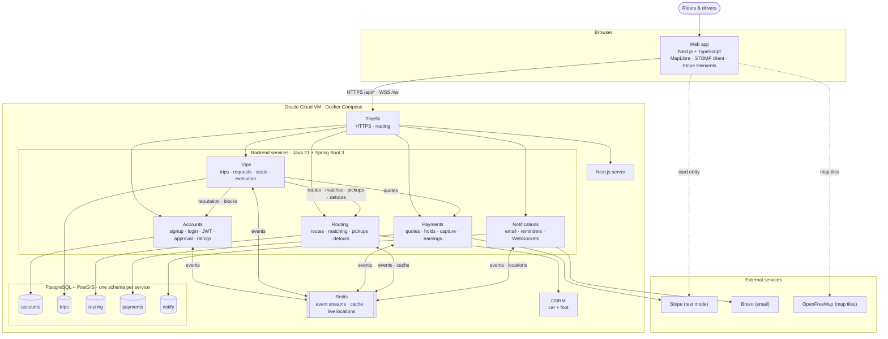
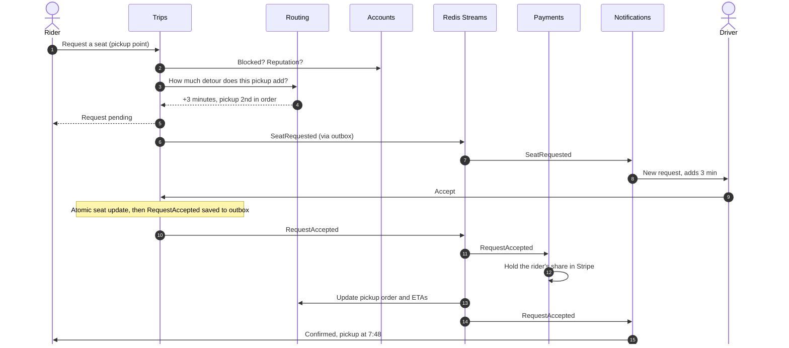

# Architecture

> Back to [README](../../README.md) · [Sprint 0](../../sprint0.md) · [Technology stack](tech-stack.md) · [Decision records](adr/README.md)

This page describes the major parts of GetDrove and how they interact. It reflects the decisions made at the end of Sprint 0 and is updated every sprint. A detailed, editable version of the diagrams is in [`getdrove-architecture.drawio`](getdrove-architecture.drawio) (open it with diagrams.net or the VS Code Draw.io Integration extension).

## Components

| Component | Responsibility |
|---|---|
| **Web app** | Next.js + TypeScript client for riders and drivers. Mobile-first, responsive. Pages stay thin; logic lives in feature modules. |
| **Traefik** | The only public entry point. HTTPS via Let's Encrypt; routes `/api/<service>/*` to services, `/ws` to Notifications, and everything else to the Next.js server. No business or auth logic. |
| **Accounts** | Signup restricted to `@myumanitoba.ca`, email verification, login, JWT issuing (RS256) and the JWKS endpoint, driver documents and vehicle, admin approval, ratings, reputation, blocks, reports. |
| **Trips** | One-off and recurring trips, seat requests, eligibility rules, manual and automatic acceptance, atomic seat counting, trip execution (start, pickup, no-show, complete), share links. |
| **Routing** | Computes and stores driving routes (PostGIS), finds trips that pass near a rider by road-network distance, suggests pickup points, calculates detours with pickup ordering, and returns rider-safe route geometry (driver's start hidden). Uses OSRM. |
| **Payments** | Distance-based price quotes, rider card setup, holds on acceptance, capture after completion, release on cancellation, earnings ledger with simulated weekly settlement. Uses Stripe in test mode. |
| **Notifications** | In-app and email notifications, scheduled reminders, and realtime over WebSockets (live driver location, trip chat, notification push). Uses Brevo for email. |
| **PostgreSQL + PostGIS** | One instance; each service has its own schema and database user, so services can't read each other's data. |
| **Redis** | Event streams between services, a cache for routing data, and the latest driver locations. Runs with AOF persistence. |
| **OSRM** | Self-hosted routing engine with car and foot profiles, built from a Winnipeg map extract. |

## Communication boundaries

- **Browser to backend:** REST over HTTPS and WebSockets (STOMP) over WSS, always through Traefik. One origin, so no CORS in production.
- **Authentication:** Accounts issues short-lived JWTs. **Each service validates tokens itself** using Accounts' public key (JWKS). Traefik does no auth.
- **Synchronous calls between services:** REST over the private Docker network to `/internal/…` endpoints, which Traefik never exposes. Used when the caller needs an answer immediately (e.g. Trips asking Routing for a detour quote).
- **Asynchronous events:** published to **Redis Streams** through a **transactional outbox** (the event is saved in the same database transaction as the change, then relayed). Each consuming service reads with its own consumer group and processes events idempotently, so events survive restarts and duplicates are harmless.
- **Data ownership:** a service only reads and writes its own schema. Other services' data is reached only through APIs or events.
- **External services:** Stripe (payments), Brevo (email), and OpenFreeMap (map tiles, loaded directly by the browser). Card details go from the browser straight to Stripe and never touch our servers.

## Example flow: a rider requests a seat and the driver accepts

## Deployment

Everything runs as Docker containers on one **Oracle Cloud Always Free VM** (ARM64), started with Docker Compose. Every merge to `develop` triggers GitHub Actions to build `linux/arm64` images, push them to GitHub Container Registry, and redeploy the live site. Tagged releases on `main` publish versioned images to DockerHub. The same Compose setup runs the whole system locally with one command. See [ADR 0007](adr/0007-hosting-and-environments.md).

## How the design supports our non-functional expectations

- **Routing is isolated** because it's the most expensive service and the main scalability bottleneck. It can be load-tested and optimized on its own, and if it's down, accepted trips are unaffected.
- **Notifications is decoupled through events**, so trips keep running if it's down; events wait in Redis and are delivered once it recovers.
- **One schema per service** keeps data ownership clear and stops services depending on each other's internals.
- **The outbox and idempotent consumers** mean no event is lost or applied twice.

See [non-functional expectations](../product/non-functional.md).
