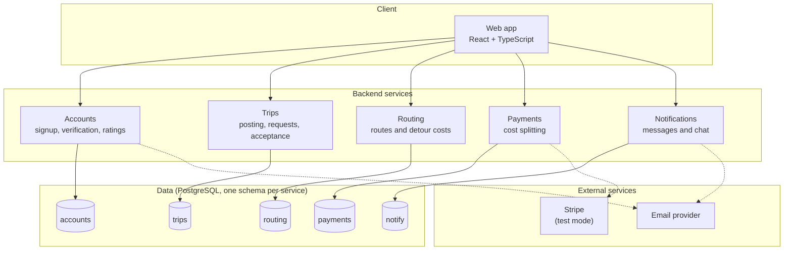
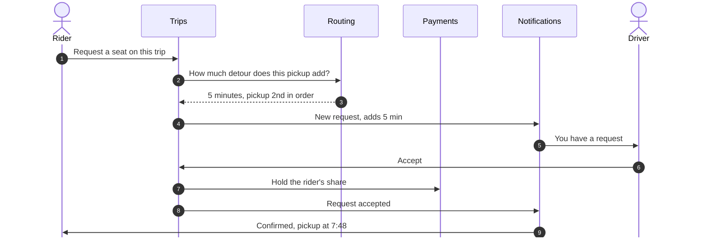

# Architecture (preliminary)

> Back to [README](../../README.md) · [Sprint 0](../../sprint0.md)

This is our Sprint 0 sketch of the major parts of the system and how they interact. It will evolve as we build. Technology choices are in the [technology stack](tech-stack.md).

## Components

| Component | Responsibility |
|---|---|
| **Web app** | React + TypeScript client used by riders and drivers. Mobile-first. |
| **Accounts** | Signup restricted to UofM email, verification, login and tokens, driver document approval, ratings. |
| **Trips** | Posting one-off and recurring trips, seat requests, acceptance and auto-accept rules, seat counts, trip status. |
| **Routing** | Computes driving routes with a self-hosted routing engine, finds trips that pass near a rider, suggests pickup points, and calculates detour costs. |
| **Payments** | Distance-based cost splitting, holding funds on acceptance, capturing after the trip, and refunds, through Stripe in test mode. |
| **Notifications** | Reminders, trip updates, and trip group chat. |
| **Data** | PostgreSQL with one schema per service. Each service reads and writes only its own schema; PostGIS is used where location queries are needed. |

## Communication boundaries

- The web app talks to the services over HTTP APIs, through a single API gateway (Traefik, tentative) that routes requests and checks login tokens.
- Services never read each other's data. They communicate through documented APIs, or by publishing events on a message broker (Redis Streams, tentative) that other services react to.
- Live driver location and trip chat use WebSockets.
- The whole system, including the routing engine, runs locally with Docker Compose.

## Example request flow

A rider requests a seat and the driver accepts:

## How the design supports our non-functional expectations

- **Routing is isolated** because it's the most expensive service and the main scalability bottleneck. It can be load-tested and scaled on its own, and if it's down, accepted trips are unaffected.
- **Notifications is isolated** so trips keep running if it's down; messages are delivered once it recovers.
- **One schema per service** keeps data ownership clear and stops services depending on each other's internals.

See [non-functional expectations](../product/non-functional.md).
