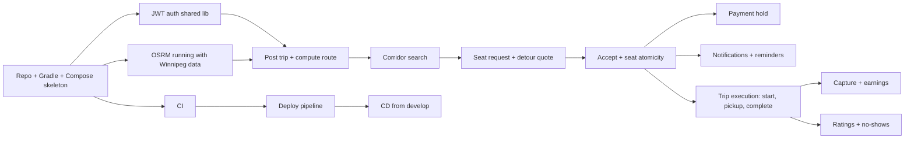
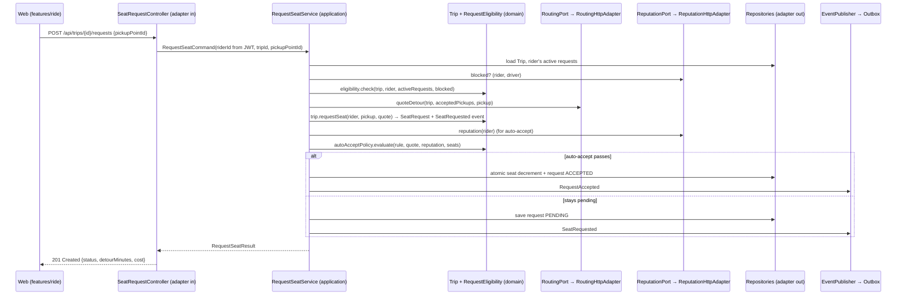
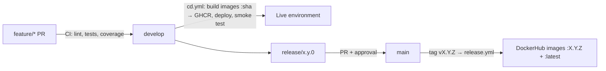

# GetDrove Implementation Plan

> Team Code Bros · COMP 4350 · Prepared after Sprint 0
>
> This plan covers Sprint 1 through the final demo. All technology decisions were made at the end of Sprint 0 and are recorded as Architecture Decision Records in `docs/architecture/adr/` (summary in [section 8](#8-technology-decisions)).

**Assumptions used throughout** (adjust if wrong):

- Three sprints of about 3 weeks each (≈ 9 weeks). Sprint 3 overlaps the final demo window in the last two weeks of class.
- Everyone can give roughly 8–10 hours per week; exam weeks are lighter.
- The repo is public (so GitHub Actions minutes, CodeQL, and GHCR are free).
- All five services use **Java 21 + Spring Boot 3**, built with Gradle ([ADR 0003](docs/architecture/adr/0003-backend-framework.md)). The frontend uses **Next.js + TypeScript**.

## Contents

1. [Overall strategy and project flow](#1-overall-strategy-and-project-flow)
2. [Repository structure](#2-repository-structure)
3. [Sprint-by-sprint plan](#3-sprint-by-sprint-plan)
4. [Per-service design](#4-per-service-design)
5. [Cross-cutting concerns](#5-cross-cutting-concerns)
6. [Infrastructure and DevOps](#6-infrastructure-and-devops)
7. [Testing strategy](#7-testing-strategy)
8. [Technology decisions](#8-technology-decisions)
9. [Risks, mitigations, and scope cuts](#9-risks-mitigations-and-scope-cuts)
10. [Getting started this week](#10-getting-started-this-week)

---

## 1. Overall strategy and project flow

### 1.1 The guiding principle: thin and complete before wide

The Sprint 1 instructions say it directly: a smaller amount of coherent, working functionality beats unfinished breadth. With five services, the biggest risk isn't any single feature, it's **integration**: six people building five services that don't talk to each other until week 3. So the order is:

1. **Walking skeleton (Sprint 1, weeks 1–2).** Every moving part exists and is connected end to end, even if each does very little: browser → Traefik → services → PostgreSQL / Redis / routing engine, built by CI, deployed to a live URL.
2. **First vertical slice (Sprint 1, weeks 2–3).** One real user journey works on the live site: *sign up with UofM email → verify → driver posts a trip (real route computed) → rider searches from their area and sees only trips that pass near them, with a cost estimate.*
3. **The core loop (Sprint 2).** Requests, detour cost, acceptance, no overselling, pickup points, payment holds, notifications. After Sprint 2 the product does what the vision promises up to the moment of the ride.
4. **The ride itself and trust (Sprint 3, first half).** Live trip, chat, pickup/no-show, completion and capture, ratings, safety, earnings.
5. **Hardening (Sprint 3, second half).** Feature freeze, load testing, profiling, security scanning, DockerHub, documentation, demo rehearsal.

### 1.2 Critical path



The chain **skeleton → routing engine → post trip → search → request/detour → accept** is the spine of the product. Anything on it gets the most experienced pair of hands and is never left blocked.

### 1.3 Riskiest parts and when to tackle them

| Risk | Why it's risky | When | How |
|---|---|---|---|
| Routing engine (OSRM) and map data | Unfamiliar tool, data prep, memory, Docker setup | **Sprint 1, week 1 spike** (Rayan) | Get OSRM serving a Winnipeg extract in Compose on day 3–4. Everything route-related depends on it. |
| Deploying 5+ services | Hosting cost, networking, TLS, secrets | **Sprint 1, week 2** (Andrew) | Deploy the skeleton (even "hello" endpoints) before features exist. |
| Auth across services | Every service needs it; easy to get subtly wrong | **Sprint 1, week 1** (Fola) | One shared JWT validation library, used by all services from day one. |
| Seat overselling under concurrency | Correctness bug that only appears under load | **Sprint 2, week 1** (Andrew) | Atomic conditional update + concurrency integration test written *first*. |
| Event-driven messaging | Lost or duplicated messages, ordering | **Sprint 1** (one event: `UserRegistered`) → Sprint 2 (many) | Transactional outbox + idempotent consumers from the first event. |
| Stripe hold/capture | Hold expiry, async failures, idempotency | **Sprint 2, week 1** (Chimdi) | Spike with test cards early; manual-capture PaymentIntents. |
| WebSockets (live location, chat) | Auth on connect, proxies, reconnects | **Spike in Sprint 2 week 3**, build in Sprint 3 week 1 (Daniel, with Andrew for the Traefik/server side) | Prove an authenticated WebSocket through Traefik on the live server before Sprint 3. |

### 1.4 Is the scope realistic? An honest answer

**Feasible, but only with discipline.** 22 stories over 3 sprints is about 7 stories per sprint for 6 people, which is normal. The real cost is microservice overhead: separate builds, deployments, contracts, events, and integration testing. Expect that overhead to eat **30–40% of Sprint 1** and about 15% after that.

What makes it feasible:

1. **One framework, one build tool, shared libraries** for auth, errors, and events. No per-service reinvention.
2. **Notifications also owns realtime** (WebSockets for location and chat). No sixth service.
3. **Payouts are simulated.** Real bank payouts need Stripe Connect (onboarding, KYC). Holds, captures, and refunds are real (test mode); the "settled to your bank" status comes from a weekly scheduled job in our ledger. Document it as a known limitation.
4. **Minimal admin.** Driver approval is a tiny admin page plus a seeded admin account, not an admin product.
5. **A clear cut list** (section 9.2), agreed now so nobody argues about it in week 8.

What would make it *infeasible*: a different framework per service, Kubernetes in the critical path, building real payouts, or starting all seven features at once in Sprint 1.

### 1.5 Gaps found when comparing the mockups with the stories

The mockups imply work no story covers yet. Add these as issues during Sprint 1 planning:

| Gap | Seen in mockup | Suggested handling |
|---|---|---|
| Login, logout, token refresh | "Log in" link on sign-up | New story under Accounts (Sprint 1) |
| Vehicle details (make, colour, plate) | Live trip, trip detail, rating | Add to the driver-approval story (Sprint 2) |
| Admin approval of drivers | Implied by "pending/approved/rejected" | New task: admin endpoint + minimal page (Sprint 2) |
| Rider payment method (test card) | Implied by holds | New story under Payments (Sprint 2) |
| Driver's start hidden from riders | "Driver's start hidden" | Acceptance criterion on route display; Routing returns route trimmed from first pickup |
| In-app notifications (bell) | Bell icon | Part of Notifications stories (Sprint 2) |
| My trips page | Nav "My trips" | New small story (Sprint 2) |
| Earnings statement download | "Statement" button | Optional; on the cut list |
| Quick chat replies | "I'm at the pickup" | Optional; on the cut list |
| Driver in-trip screen, auto-accept settings, request-pending state, document upload, share page | Not mocked | Kelvin designs them in the same style as the stories land |


---

## 2. Repository structure

### 2.1 Monorepo or polyrepo? ✅ Decided: monorepo

| | Monorepo (one repo) | Polyrepo (one repo per service) |
|---|---|---|
| Fits what we already have | ✅ Issues, board, labels, docs, Git Flow, and branch protection are all in one repo | ❌ Would need to split the board, docs, and protection rules across 6+ repos |
| Cross-service changes (e.g. a new event) | One PR changes producer, consumer, and contract together | Coordinated PRs across repos, easy to get out of sync |
| Shared code (auth, events, errors) | Plain Gradle subprojects | Must publish versioned packages |
| CI | One workflow with path filters, so only changed services build | One pipeline per repo, duplicated config |
| Independence | Less: one repo's history, one set of protections | More: each team owns its repo fully |
| Grading | One place for the instructor to look | Evaluator has to visit many repos |

**Decision: monorepo** (agreed by the team). Polyrepo's advantage (independent teams with independent release cycles) doesn't apply to a 6-person team with one release per sprint.

### 2.2 Full directory tree

```text
COMP-4350-Group5-GetDrove/
├── README.md                      # Project entry point (permanent)
├── sprint0.md … sprint3.md        # Milestone landing pages
├── CONTRIBUTING.md                # Links to docs/process/
├── settings.gradle.kts            # Includes libs/* and services/*
├── build.gradle.kts               # Shared Gradle config (Java 21, Spotless, JaCoCo)
├── gradle/libs.versions.toml      # One version catalog for every service
├── .editorconfig
├── .env.example                   # Every variable, no real values
│
├── .github/
│   ├── workflows/
│   │   ├── ci.yml                 # PRs + pushes: lint, test, coverage, build (path-filtered)
│   │   ├── cd.yml                 # Push to develop: build images, deploy, smoke test
│   │   ├── release.yml            # Tag v*.*.* on main: publish versioned images to DockerHub
│   │   ├── codeql.yml             # Static analysis (Sprint 3 requirement, start in Sprint 2)
│   │   └── security.yml           # Trivy image scan + dependency checks
│   ├── dependabot.yml
│   ├── ISSUE_TEMPLATE/ …
│   └── pull_request_template.md
│
├── contracts/                     # The source of truth between services and the frontend
│   ├── openapi/                   # Exported OpenAPI spec per service (generated in CI, committed)
│   │   ├── accounts.yaml
│   │   ├── trips.yaml
│   │   ├── routing.yaml
│   │   ├── payments.yaml
│   │   └── notifications.yaml
│   └── events/                    # JSON Schema for every event on the broker
│       ├── README.md              # Event catalogue: name, producer, consumers, schema link
│       ├── user-registered.v1.json
│       ├── request-accepted.v1.json
│       └── …
│
├── libs/                          # Shared Java code. Kept small and boring on purpose.
│   ├── common-web/                # ProblemDetail error handler, correlation-ID filter, pagination
│   ├── common-security/           # JWT validation config, current-user resolver, role checks
│   └── events/                    # Event envelope, event records, outbox + Redis Streams publisher/consumer helpers
│
├── services/
│   ├── accounts/                  # Fola
│   ├── trips/                     # Andrew  (full layout shown in 2.3)
│   ├── routing/                   # Rayan
│   ├── payments/                  # Chimdi
│   └── notifications/             # Daniel  (includes WebSocket realtime)
│       ├── build.gradle.kts
│       ├── Dockerfile
│       ├── README.md              # What it does, API, events, how to run/test, owner's tool choices
│       └── src/…
│
├── web/                           # Kelvin — Next.js + TypeScript (layout in 2.5)
│
├── infra/
│   ├── docker-compose.yml         # Local dev: everything with one command
│   ├── docker-compose.prod.yml    # Overrides for the live server (images, TLS, resources)
│   ├── traefik/                   # Gateway config (routes, middlewares, TLS)
│   ├── postgres/init/             # Creates one schema + one DB user per service
│   ├── osrm/
│   │   ├── prepare.sh             # Downloads Manitoba extract, clips to Winnipeg, builds car + foot graphs
│   │   └── README.md
│   ├── seed/                      # Demo and load-test data (users, drivers, trips)
│   └── k8s/                       # OPTIONAL learning area, not deployed or graded (see 6.6)
│
├── load-tests/
│   ├── jmeter/getdrove-baseline.jmx
│   ├── data/                      # CSV of test users and pre-issued tokens
│   └── reports/                   # Generated HTML reports for sprint3.md
│
├── scripts/                       # dev.sh, seed, token generation, OpenAPI export
│
└── docs/
    ├── product/                   # vision, core features, non-functional (exists)
    ├── architecture/
    │   ├── architecture.md        # Kept current every sprint
    │   ├── tech-stack.md
    │   └── adr/                   # Architecture Decision Records: 0001-monorepo.md … 0015-driver-approval.md
    ├── api/README.md              # How to read the contracts, Swagger UI links, examples
    ├── testing/
    │   ├── testing-strategy.md    # Durable testing doc required from Sprint 1
    │   └── regression.md          # Sprint 2 regression process
    ├── deployment/
    │   ├── local-setup.md         # Required software, env vars, run, test, common issues
    │   └── deployment.md          # Hosting, CD flow, secrets, how to tell if a deploy failed
    ├── performance/               # Sprint 3 load-test report and profiling investigation
    ├── security/                  # Sprint 3 static-analysis findings and responses
    ├── retros/                    # sprint1.md, sprint2.md … short retros
    └── process/                   # working agreement, git workflow, etc. (exists)
```

Architecture Decision Records (`docs/architecture/adr/`) are worth it: each decision in section 8 has a one-page ADR (context, options, decision, consequences). It's direct evidence for "explains technical decisions" in every demo rubric, and it keeps the AI rule honest, since the record shows the *team* decided.

### 2.3 Clean Architecture inside a service (Trips, full example)

```text
services/trips/
├── build.gradle.kts
├── Dockerfile
├── README.md
└── src/
    ├── main/
    │   ├── java/ca/getdrove/trips/
    │   │   ├── domain/                         # Pure Java. No Spring, no JPA, no HTTP.
    │   │   │   ├── model/
    │   │   │   │   ├── Trip.java               # Aggregate: seats, status, departure, invariants
    │   │   │   │   ├── SeatRequest.java
    │   │   │   │   ├── TripSeries.java         # Recurring pattern
    │   │   │   │   ├── RecurrencePattern.java  # Value object: weekdays + end date
    │   │   │   │   ├── AutoAcceptRule.java
    │   │   │   │   ├── GeoPoint.java           # Value object
    │   │   │   │   ├── TripStatus.java
    │   │   │   │   └── RequestStatus.java
    │   │   │   ├── policy/
    │   │   │   │   ├── AutoAcceptPolicy.java   # detour ≤ max, rating ≥ min, no-shows ≤ threshold, seat free
    │   │   │   │   ├── RequestEligibility.java # not own trip, no overlap, not blocked, not already on it
    │   │   │   │   └── RecurrenceExpander.java # pattern → list of occurrence dates
    │   │   │   ├── event/                      # Domain events raised by aggregates
    │   │   │   │   ├── SeatRequested.java
    │   │   │   │   ├── RequestAccepted.java
    │   │   │   │   └── TripCancelled.java …
    │   │   │   └── exception/
    │   │   │       ├── NoSeatsLeftException.java
    │   │   │       ├── DepartureInPastException.java
    │   │   │       └── OverlappingRequestException.java …
    │   │   │
    │   │   ├── application/                    # Use cases. Depends only on domain + ports.
    │   │   │   ├── port/
    │   │   │   │   ├── in/                     # One interface per use case
    │   │   │   │   │   ├── PostTripUseCase.java
    │   │   │   │   │   ├── SearchTripsUseCase.java
    │   │   │   │   │   ├── RequestSeatUseCase.java
    │   │   │   │   │   ├── AcceptRequestUseCase.java
    │   │   │   │   │   └── CancelTripUseCase.java …
    │   │   │   │   └── out/                    # What the use cases need from the outside world
    │   │   │   │       ├── TripRepository.java
    │   │   │   │       ├── SeatRequestRepository.java
    │   │   │   │       ├── RoutingPort.java    # computeRoute, matchCandidates, quoteDetour, pickupPoint
    │   │   │   │       ├── ReputationPort.java # rating, no-show count, block check (Accounts)
    │   │   │   │       ├── PricingPort.java    # cost quote (Payments)
    │   │   │   │       └── EventPublisher.java
    │   │   │   ├── service/                    # Use case implementations (plain classes)
    │   │   │   │   ├── PostTripService.java
    │   │   │   │   ├── RequestSeatService.java
    │   │   │   │   └── AcceptRequestService.java …
    │   │   │   └── command/                    # Input/output records for use cases
    │   │   │
    │   │   ├── adapters/                       # Interface adapters: translate between outside and inside
    │   │   │   ├── in/
    │   │   │   │   ├── web/                    # REST controllers, request/response DTOs, mappers
    │   │   │   │   │   ├── TripController.java
    │   │   │   │   │   ├── SeatRequestController.java
    │   │   │   │   │   └── dto/ …
    │   │   │   │   └── messaging/              # Event listeners (DriverApproved, PaymentFailed, …)
    │   │   │   └── out/
    │   │   │       ├── persistence/            # JPA entities, Spring Data repos, adapters, mappers
    │   │   │       │   ├── TripJpaEntity.java
    │   │   │       │   ├── TripJpaRepository.java
    │   │   │       │   └── TripRepositoryAdapter.java   # implements TripRepository
    │   │   │       ├── routing/RoutingHttpAdapter.java  # implements RoutingPort via RestClient
    │   │   │       ├── accounts/ReputationHttpAdapter.java
    │   │   │       ├── payments/PricingHttpAdapter.java
    │   │   │       └── messaging/
    │   │   │           ├── OutboxEventPublisher.java    # implements EventPublisher (writes outbox row)
    │   │   │           └── OutboxRelay.java             # scheduled: outbox → Redis Streams
    │   │   │
    │   │   └── infrastructure/                 # Framework wiring and bootstrapping only
    │   │       ├── TripsApplication.java
    │   │       └── config/
    │   │           ├── UseCaseConfig.java      # @Bean wiring of services to ports
    │   │           ├── SecurityConfig.java     # uses libs/common-security
    │   │           ├── RedisConfig.java
    │   │           └── OpenApiConfig.java
    │   └── resources/
    │       ├── application.yml
    │       └── db/migration/V1__init.sql       # Flyway migrations
    └── test/java/ca/getdrove/trips/
        ├── domain/                             # Fast unit tests, no mocks needed
        ├── application/                        # Use case tests with in-memory fakes of ports
        ├── adapters/                           # Integration: Testcontainers (Postgres/PostGIS, Redis), WireMock
        ├── architecture/ArchitectureTest.java  # ArchUnit dependency rules
        └── concurrency/SeatOversellIT.java     # The concurrency test from the user story
```

**How Spring Boot maps onto the layers.** Spring annotations (`@RestController`, `@Entity`, `@Repository`, `@Configuration`) appear only in `adapters/` and `infrastructure/`. Domain classes and use case services are plain Java. Use cases are registered as beans in `UseCaseConfig`, so they don't need `@Service`:

```java
@Configuration
class UseCaseConfig {
    @Bean
    RequestSeatUseCase requestSeat(TripRepository trips, SeatRequestRepository requests,
                                   RoutingPort routing, PricingPort pricing,
                                   ReputationPort reputation, EventPublisher events, Clock clock) {
        return new RequestSeatService(trips, requests, routing, pricing, reputation, events, clock);
    }
}
```

Transactions: put `@Transactional` on the adapter that calls the use case (the controller or listener), or wrap use cases with a small transaction decorator in `infrastructure/`, so the application layer stays framework-free.

**Enforcing the dependency rule.** Start with packages + ArchUnit (cheap, fast to set up). Move a service to Gradle sub-modules (`domain`, `application`, `adapters`, `app`) only if ArchUnit violations keep appearing.

```java
@AnalyzeClasses(packages = "ca.getdrove.trips")
class ArchitectureTest {
    @ArchTest
    static final ArchRule layers = layeredArchitecture().consideringOnlyDependenciesInLayers()
        .layer("Domain").definedBy("..domain..")
        .layer("Application").definedBy("..application..")
        .layer("Adapters").definedBy("..adapters..")
        .layer("Infrastructure").definedBy("..infrastructure..")
        .whereLayer("Infrastructure").mayNotBeAccessedByAnyLayer()
        .whereLayer("Adapters").mayOnlyBeAccessedByLayers("Infrastructure")
        .whereLayer("Application").mayOnlyBeAccessedByLayers("Adapters", "Infrastructure")
        .whereLayer("Domain").mayOnlyBeAccessedByLayers("Application", "Adapters", "Infrastructure");

    @ArchTest
    static final ArchRule domainIsPure = noClasses().that().resideInAPackage("..domain..")
        .should().dependOnClassesThat().resideInAnyPackage("org.springframework..", "jakarta.persistence..");
}
```

### 2.4 Full vs light Clean Architecture

| Service | Level | Why |
|---|---|---|
| **Trips** | Full: separate domain model and JPA entities, policies, domain events | Most business rules (seats, eligibility, auto-accept, recurrence, state machine). Most tests live here. |
| **Routing** | Full in the core: matching, pickup selection, and detour/insertion algorithms are pure domain code; OSRM and PostGIS are adapters | The algorithms are the hardest code in the project and must be unit-testable without OSRM. |
| **Payments** | Full | Money rules (pricing, no-show policy, hold expiry) need to be precise and tested; Stripe sits behind a port so tests never hit Stripe. |
| **Accounts** | Light: same folders, but JPA entities may double as the domain model for simple data (users, documents); keep real rules (email domain, token expiry, rating visibility) in domain classes | Mostly CRUD plus a few rules. |
| **Notifications** | Light: use cases + ports for email/WebSocket senders and the scheduler; minimal domain model | Mostly plumbing: consume events, store, deliver. |

**Starting lean in Sprint 1 without a rewrite later:** create all four package folders in every service on day one, write use cases as plain classes behind `port.in` interfaces, and put every external call (DB, OSRM, Stripe, broker, email) behind a `port.out` interface from the first commit. Skip separate mapper classes and command objects where a record suffices. Because the boundaries exist from day one, adding detail later is additive, not a rewrite.

### 2.5 Frontend structure (Next.js + TypeScript) ✅ Decided

The team chose **Next.js with TypeScript** using the **App Router**. Next.js handles routing through the `app/` folder, so the mockup URLs (`/ride/results`, `/drive/new`, …) map directly onto folders. Business logic and API access stay in `features/`, so pages stay thin and the Clean Architecture split still applies.

```text
web/
├── package.json
├── next.config.ts                  # output: 'standalone' for a small Docker image
├── middleware.ts                   # Redirects signed-out users away from protected routes
├── Dockerfile                      # Multi-stage: next build, then run the standalone Node server
├── eslint.config.mjs               # next lint rules + eslint-plugin-boundaries
├── vitest.config.ts
└── src/
    ├── app/                        # Routing only: pages and layouts stay thin
    │   ├── layout.tsx              # Root layout: providers, top nav, fonts
    │   ├── providers.tsx           # "use client": QueryClient, session, realtime connection
    │   ├── (auth)/
    │   │   ├── signup/page.tsx
    │   │   ├── login/page.tsx
    │   │   └── verify/page.tsx
    │   ├── ride/
    │   │   ├── page.tsx            # Rider home ("Where are you heading?")
    │   │   ├── results/page.tsx
    │   │   ├── trip/[id]/page.tsx  # Trip detail with pickup point and cost
    │   │   ├── live/page.tsx       # Live trip
    │   │   ├── live/chat/page.tsx
    │   │   └── rate/page.tsx
    │   ├── drive/
    │   │   ├── new/page.tsx        # Post a trip
    │   │   ├── trip/[id]/requests/page.tsx
    │   │   ├── trip/[id]/live/page.tsx    # Driver in-trip screen
    │   │   ├── settings/page.tsx   # Auto-accept rules, documents, vehicle
    │   │   └── earnings/page.tsx
    │   ├── trips/page.tsx          # My trips
    │   ├── share/[token]/page.tsx  # Public share page (no account needed)
    │   └── admin/drivers/page.tsx  # Minimal driver approval
    ├── features/                   # One folder per product area, mirroring the services
    │   ├── auth/
    │   │   ├── ui/                 # SignupForm.tsx, LoginForm.tsx, VerifyStatus.tsx
    │   │   ├── hooks/              # useSignup.ts, useSession.ts  (application layer)
    │   │   ├── api/                # authApi.ts — calls the generated client (adapter)
    │   │   └── model/              # Pure types and rules: isUofMEmail(), passwordRules
    │   ├── ride/                   # Rider home, results, trip detail, request flow
    │   ├── drive/                  # Post trip, pending requests, auto-accept, in-trip screen
    │   ├── trip-live/              # Live map, ETA, stale-data indicator
    │   ├── chat/
    │   ├── payments/               # Card setup (Stripe Elements), cost display
    │   ├── earnings/
    │   ├── ratings/
    │   └── notifications/          # Bell, list, toasts
    └── shared/
        ├── ui/                     # Design system: Button, Card, BottomSheet, Badge …
        ├── map/                    # MapView (client-only, loaded with next/dynamic, ssr: false)
        ├── api/
        │   ├── generated/          # Types generated from contracts/openapi (openapi-typescript)
        │   ├── http.ts             # fetch wrapper: base URL, token, refresh, ProblemDetail parsing
        │   └── realtime.ts         # WebSocket/STOMP client with reconnect
        ├── lib/                    # Formatting (money, times), geo helpers
        └── config/
```

**How Next.js fits this architecture:**

- **Next.js is the frontend only.** The Spring Boot services stay the backend; we don't put business logic in Next.js route handlers or server actions. Traefik routes `/api/*` and `/ws` to the services and everything else to the Next.js server, so the browser talks to one origin.
- **Mostly client components.** Pages with maps, live location, chat, and forms are interactive, so they use `"use client"` and TanStack Query. MapLibre touches the browser's `window`, so the map component is loaded with `next/dynamic` and `ssr: false`. Server rendering is useful mainly for the sign-up page and the public share page (fast first load).
- **Route protection:** `middleware.ts` checks for the refresh-token cookie (set by Accounts on the same origin) and redirects to `/login` if it's missing. Real authorization is still enforced by each backend service.
- **Page files stay thin:** a `page.tsx` composes components from `features/`; it doesn't call APIs directly.

Rules enforced by `eslint-plugin-boundaries`: `app/` pages may import only from `features/` and `shared/`; `ui` may import `hooks` and `model`; `hooks` may import `api` and `model`; `model` imports nothing from React or the network; features don't import each other's internals (only through a feature's `index.ts`). Data fetching uses TanStack Query; forms use React Hook Form + Zod.


---

## 3. Sprint-by-sprint plan

### 3.0 The shape of the term

| | Sprint 1 (≈ weeks 1–3) | Sprint 2 (≈ weeks 4–6) | Sprint 3 (≈ weeks 7–9) |
|---|---|---|---|
| **Product goal** | Walking skeleton + first vertical slice: sign up, post a trip, find trips that pass near you | The core loop: request, detour, accept, pickup points, payment holds, notifications | The ride and trust: live trip, chat, completion, capture, ratings, safety, earnings |
| **Engineering goal** | CI, tests with coverage, API docs, live deployment | Regression suite, CD from `develop`, cross-team testing | Load test, profiling, security scanning, DockerHub, final docs |
| **Release** | `v0.1.0` | `v0.2.0` | `v1.0.0` |
| **Stories** | 3 + new login story | 11 | 10 |

Stories per sprint (by issue title):

- **Sprint 1:** Sign up with UofM email · Login (new) · Post a trip · Show only trips that pass near the rider · See my cost before requesting (estimate only)
- **Sprint 2:** Upload licence and insurance for driver approval (+ vehicle, admin approval) · Post a recurring weekday trip · Cancel a posted trip · Suggested pickup point on the route · Request a seat on a trip · Detour cost per request · Auto-accept rules · Seats cannot be oversold · Charge only after the trip happens (hold + release part) · Trip reminder before departure · Payment method setup (new)
- **Sprint 3:** Live driver location · Mark riders as picked up or no-show · Trip group chat · Charge only after the trip happens (capture part) · View driver earnings · Rate the other party after a trip · Exclude repeat no-shows from auto-accept · Report or block a user · Share trip with someone outside the app · Pickup ordering and ETAs (part of trip execution)

**Speaking rotation for demo meetings** (the rubric asks that roles rotate): Sprint 1: Andrew, Rayan, Kelvin. Sprint 2: Fola, Chimdi, Daniel. Final demo: everyone has a section. Everyone attends every meeting and should be able to answer questions about any service, so do a 15-minute "teach-back" at each retro where each owner explains their service to the others.

---

### 3.1 Sprint 1: walking skeleton and first slice

**Sprint goal:** On the live URL, a UofM student can sign up, verify their email, log in, post a trip (with its real driving route computed), and a second student can search from their area and see only trips whose route passes near them, each with a cost estimate.

**Explicitly out of scope:** requesting seats, payments beyond the estimate, recurring trips, driver document approval (all drivers are treated as approved in Sprint 1, behind a feature flag).

#### Who leads what

| Person | Service / area | Sprint 1 work |
|---|---|---|
| **Andrew** | Trips + DevOps + events | Monorepo + Gradle skeleton, shared libs scaffolding, **Docker Compose for local dev, CI workflow, hosting setup and deploy pipeline to the live server**, **event library in `libs/events`** (envelope, outbox publisher, Redis Streams consumer helpers), Trips: post one-off trip, list my trips, search endpoint (time filter + call Routing) |
| **Fola** | Accounts | Signup with domain validation, verification tokens (24 h expiry, resend), login + JWT (RS256) + JWKS endpoint, `common-security` library (Rayan reviews as Technical Lead), duplicate-email handling |
| **Rayan** | Routing | OSRM spike (day 1–4), compute and store route on trip post (PostGIS LineString), corridor search (prefilter + road-network check), route duration for the post-trip confirmation |
| **Chimdi** | Payments + testing lead | Pricing domain (distance-based quote) + `POST /payments/quotes`, owns `docs/testing/testing-strategy.md` and the coverage setup (JaCoCo + Vitest) across services |
| **Daniel** | Notifications + docs | Notifications consumes `UserRegistered` and sends the verification email (Mailpit locally) using the event library, docs lead for setup, API docs, and sprint1.md |
| **Kelvin** | Web app | Next.js + TypeScript scaffold (App Router), design tokens from the mockups, shared UI (Button, BottomSheet, MapView), pages: sign-up, verify, login, rider home, results, post trip; API client generated from OpenAPI |

#### Dependencies and order

1. **Day 1–2:** decisions meeting (framework, broker, gateway, hosting, routing engine). Nothing else is blocked longer than this.
2. **Andrew's skeleton (day 2–3)** unblocks everyone. Until then, people work in their own service folder with the agreed package layout.
3. **Fola's `common-security` (week 1)** is needed before any protected endpoint is merged. Until it lands, services use a dev profile that accepts a fixed test token.
4. **Rayan's OSRM spike (day 3–4)** is needed for post trip and search. If it slips, Routing returns a straight-line route from a stub adapter so Trips and the frontend aren't blocked. (This is exactly what the `RoutingPort` makes cheap.)
5. **Contracts first:** for each endpoint between people, the provider writes the OpenAPI operation (request/response, errors, example) and gets the consumer's approval in a PR *before* implementing. Kelvin builds against MSW mocks of those contracts.

#### Week by week

| Week | Focus | Done when |
|---|---|---|
| **1** | Decisions + ADRs, monorepo skeleton, Compose (Postgres + PostGIS, Redis, OSRM, Mailpit, Traefik), CI running lint + build on PRs, `common-security` draft, signup endpoint, pricing domain, frontend scaffold + design tokens, OSRM serving Winnipeg routes | `docker compose up` starts everything; CI is green on a trivial PR; OSRM returns a route between two Winnipeg points |
| **2** | Signup → `UserRegistered` → verification email, login + JWT, post trip with real route, corridor search, quotes, frontend pages wired to real APIs; **deploy the skeleton to the live server** | A trip posted locally appears in a search from Osborne Village but not from across the river; the live URL serves the frontend and `/health` of every service |
| **3** | Integration and hardening of the slice, unit + integration tests, coverage reports, API docs, architecture diagram update, local-setup doc, sprint1.md, retro, release `v0.1.0`, demo rehearsal | The full slice works on the live URL with seeded data; all checklist items below are ticked |

#### Course deliverables and owners

| Deliverable (from Sprint 1 instructions) | Owner | Notes |
|---|---|---|
| Working integrated vertical slice | Everyone (Andrew coordinates integration) | The goal above |
| Unit + integration tests, acceptance-criteria evidence | Each owner for their service; Chimdi reviews | Link tests to stories in the issue (e.g. "AC 1 → `SignupServiceTest.rejectsNonUofMEmail`") |
| Testing documentation + coverage evidence | Chimdi | `docs/testing/testing-strategy.md`, JaCoCo + Vitest screenshots/artifacts |
| CI workflow + explanation | Andrew | Lint + unit + integration tests on PRs and pushes to `develop` |
| API / interface documentation | Each owner; Daniel compiles `docs/api/README.md` | springdoc Swagger UI per service + exported specs in `contracts/openapi/`, event schemas in `contracts/events/` |
| Architecture diagram (current) | Rayan (Technical Lead) | Update `docs/architecture/architecture.md` to show Traefik, Redis, OSRM, Mailpit/email |
| Local setup documentation | Daniel (Andrew writes the Compose and environment sections) | `docs/deployment/local-setup.md` |
| Live deployment (full-mark target) | Andrew | Live URL + deployment notes (`docs/deployment/deployment.md`) |
| Reflection / retro + known issues | Chimdi (facilitates as Project Coordinator) | `docs/retros/sprint1.md`, summarized in sprint1.md |
| sprint1.md | Daniel (Documentation Lead) | Structure below |
| Release `v0.1.0` | Andrew (GitHub Manager) | Release branch → main → tag |

#### Demo meeting (Sprint 1)

1. **(2 min) Context:** what Sprint 1 set out to do; the vertical-slice choice.
2. **(6 min) Live demo on the deployed URL:** sign up with a non-UofM email (rejected) → UofM email → verification email → log in. Second account (driver) posts a trip from Wolseley; show the route and estimated duration. Rider in Osborne Village searches and sees the trip with a cost estimate; rider "across the river" with no connecting road doesn't.
3. **(5 min) Technical evidence:** architecture diagram (what's real now), one Clean Architecture walkthrough (post trip), CI run, coverage report, Swagger UI.
4. **(2 min) Known issues and next sprint.**
5. **Q&A:** everyone ready on their service.

Prepare: two seeded accounts already verified (in case email is slow), seeded trips, a backup screen recording.

#### Rubric checklist: Sprint 1 content (aim for "Excellent" on each)

| Criterion | Excellent looks like… | Our evidence | Owner |
|---|---|---|---|
| Documentation & milestone readiness | sprint1.md clear and complete, all evidence linked and current | sprint1.md with every section below; links checked the day before submission | Daniel |
| Working software & codebase quality | Integrated functionality that adds value; readable, modular, separated responsibilities | The vertical slice; Clean Architecture packages + ArchUnit test; Spotless formatting | Everyone; Rayan reviews structure |
| Testing strategy & evidence | Unit + integration tests, AC evidence, tools/mocking documented, coverage interpreted | testing-strategy.md naming JUnit 5, Mockito, Testcontainers, WireMock, Vitest, MSW; coverage screenshots with a paragraph on what's under-tested and why | Chimdi |
| CI & automation | CI runs automatically on a sensible event with meaningful checks and tests; trigger documented | `ci.yml` on PRs and pushes to `develop`: lint, unit, integration, coverage; explained in sprint1.md | Andrew |
| Architecture, API & developer docs | Current architecture, usable API contracts, clear setup/run/test instructions | Updated diagram, Swagger + exported specs + event catalogue, local-setup.md tested by someone who didn't write it | Rayan, Daniel |
| Deployment progress & reflection | Accessible deployment, config documented, secrets handled; thoughtful reflection incl. testing in workflow | Live URL; deployment.md; GitHub Secrets only; retro answering every course prompt | Andrew, Chimdi |

#### Rubric checklist: Sprint 1 demo meeting

| Criterion | What we do |
|---|---|
| Preparation & organization | Run-sheet with timings; seeded accounts; tabs pre-opened; rehearsed once end to end |
| Working product demonstration | Realistic workflow on the live URL, not localhost |
| Technical explanation & evidence | Each technical claim shown with an artifact (diagram, CI run, coverage, Swagger) |
| Clarity of communication | Three speakers, each with a defined section; no jargon without a one-line explanation |
| Q&A & team knowledge | Teach-back session before the demo so nobody is siloed |

#### What goes in sprint1.md

Following the Sprint 1 instructions: **Sprint summary** (value added, link to the Sprint 1 milestone) · **Testing status** (unit/integration approach, tools, mocking, coverage screenshot + interpretation, link to testing-strategy.md) · **CI status** (link to workflow, what runs, trigger and why, what's next) · **API documentation** (links to Swagger UIs, `contracts/`, `docs/api/`) · **Architecture** (current diagram embedded) · **Deployment** (live URL, test accounts, links to setup and deployment docs) · **Reflection** (answers to the course's retro prompts) · **Known issues** (deferred work and limitations).

---

### 3.2 Sprint 2: the core loop

**Sprint goal:** A rider can request a seat with a private pickup point and a known cost; the driver sees the detour each request adds and accepts manually or automatically; seats are never oversold; the rider's share is held on their card; everyone gets notified and reminded. Recurring trips and cancellation work, and drivers must be approved. Every merge to `develop` deploys automatically.

#### Who leads what

| Person | Sprint 2 work |
|---|---|
| **Andrew** | Request seat (eligibility rules, overlap check), accept/decline, **atomic seat counting + concurrency test**, request-status lifecycle, consuming `PaymentFailed`, **CD workflow from `develop`** (build images, deploy, smoke test, Discord alerts), release `v0.2.0` |
| **Fola** | Driver documents upload + storage, vehicle details, approval status, admin approve/reject (endpoint + minimal page with Kelvin), `DriverApproved` event, reputation endpoint (rating, no-shows, blocks) for Trips, **recurring trips and cancel trip in Trips** (with Andrew reviewing) |
| **Rayan** | Pickup point selection (snap to drivable road, walking distance via OSRM foot profile, "choose a different point"), **detour quote with pickup-order insertion**, route caching, trimmed route for riders (start hidden), Routing error handling when OSRM is down |
| **Chimdi** | Stripe test mode: rider card setup (SetupIntent + Elements with Kelvin), hold on `RequestAccepted` (manual-capture PaymentIntent), release on decline/cancel/trip cancel, payment failure flow, hold-expiry scheduling, capture use case ready (wired in Sprint 3) |
| **Daniel** | Notifications: in-app notifications + bell API, emails for request/accept/decline/cancel, **scheduled reminders that survive downtime**, **auto-accept evaluation in Trips** (with Andrew reviewing), regression documentation, WebSocket spike through Traefik (end of sprint, with Andrew) |
| **Kelvin** | Trip detail with pickup point + cost, request flow and pending state, driver pending-requests screen with detour/rating/no-shows and "Calculating…" state, auto-accept settings, recurrence picker, document upload + status, My trips, notification bell; **leads cross-team testing** (Quality Checker) |

#### Dependencies and order

1. **Week 1 first:** Andrew's `SeatRequest` model + request endpoint contract, Rayan's detour/pickup contracts, Chimdi's Stripe spike. These three unblock everything else.
2. Detour quote (Rayan) must exist before auto-accept (Daniel) can be finished; until then, auto-accept tests use a fake `RoutingPort`.
3. Hold on acceptance (Chimdi) consumes `RequestAccepted`; agree the event schema in `contracts/events/` in week 1.
4. Reminders (Daniel) consume `RequestAccepted` and `TripCancelled`; same.
5. CD (Andrew) should be live by the **end of week 1**, so the rest of the sprint is deployed continuously.

#### Week by week

| Week | Focus | Done when |
|---|---|---|
| **4** | Contracts for requests, detours, pickup points, events; Stripe spike; seat atomicity + concurrency test; documents upload; CD pipeline from `develop`; frontend trip detail + request flow against mocks | Concurrency test passes in CI; a merge to `develop` deploys automatically |
| **5** | Detour + insertion, pickup points, accept/decline, auto-accept, holds and releases, notifications and reminders, recurring trips, cancel trip, admin approval; frontend pending requests + settings | Full journey on the live site: request → driver sees +N min → accept → hold appears in Stripe dashboard → rider notified |
| **6** | **Cross-team testing** (review assigned team, triage feedback we receive), regression doc, coverage + gaps, docs and diagram update, sprint2.md, retro, release `v0.2.0`, WebSocket spike, demo rehearsal | All checklist items ticked; feedback classified |

Cross-team testing timing is set by the course; whenever it lands, keep half a day free to triage feedback into issues labelled `feedback` with Accepted / Deferred / Rejected.

#### Course deliverables and owners

| Deliverable (from Sprint 2 instructions) | Owner |
|---|---|
| Value beyond Sprint 1, integrated and demonstrable | Everyone |
| Regression testing process (what runs, selection, when, duration, failure handling, evidence) | Daniel (with Chimdi) — `docs/testing/regression.md` |
| Coverage + known testing gaps with rationale | Chimdi |
| CI/CD: deploy on changes to `develop`; secrets; success/failure visibility | Andrew |
| Live deployment + test credentials | Andrew |
| Cross-team review of another team | Kelvin leads, two others help |
| Feedback received: ≥ 2 items across ≥ 2 categories explained | Kelvin + Chimdi |
| Current API docs + architecture diagram (with deployment relationships) | Owners + Rayan |
| Reflection + final-iteration risks | Chimdi facilitates; everyone contributes |
| sprint2.md | Daniel |

#### Demo meeting (Sprint 2)

Live: rider requests a seat with a pickup point → driver's screen shows `+3 min` and a "Calculating…" state for a second request → driver accepts → rider gets the notification → Stripe test dashboard shows the held PaymentIntent → driver cancels a different trip and the hold is released. Then show auto-accept, a recurring trip series, and the concurrency test running in CI. Technical evidence: CD run from a merge to deployment, regression suite timing, coverage gaps, one feedback item and what we did with it.

#### Rubric checklist: Sprint 2 content

| Criterion | Our evidence | Owner |
|---|---|---|
| Documentation & milestone readiness | sprint2.md covering regression, testing gaps, CI/CD, live URL + credentials, cross-team testing, feedback, API/architecture, reflection, final-iteration risks | Daniel |
| Working software & codebase quality | Core loop working on live site; refactoring noted (e.g. shared client for internal HTTP calls) | Everyone |
| Regression testing & known gaps | regression.md answering all seven course questions; recent CI run link; coverage interpreted; 2–3 real gaps with issue links and plan | Daniel, Chimdi |
| CI/CD & live deployment | `cd.yml` deploys on push to `develop`; post-deploy smoke test; status visible in Actions and in Discord via webhook; secrets in GitHub Secrets | Andrew |
| Architecture, API & developer docs | Diagram shows Traefik, broker, OSRM, Stripe, hosting; contracts current; deployment.md updated | Rayan, Andrew, Daniel |
| Cross-team testing, feedback & reflection | Useful review delivered; feedback classified with reasons; individual reflections; risks for Sprint 3 listed | Kelvin, Chimdi |

#### What goes in sprint2.md

Sprint summary · Regression testing · Testing status & gaps · CI/CD status · Live deployment (URL, test rider and driver accounts, Stripe test card `4242 4242 4242 4242`) · Cross-team testing (link to our review; at least two classified feedback items) · API & architecture · Reflection & risk.

---

### 3.3 Sprint 3: the ride, trust, and hardening

**Sprint goal:** The full trip happens on the platform: live location, chat, pickups and no-shows, completion, payment capture, ratings, safety features, and earnings. Then the system is load-tested, profiled, scanned, containerized to DockerHub, and documented as a finished product.

**Feature freeze at the end of week 8.** After that, only bug fixes, edge-case handling, performance work, and documentation.

#### Who leads what

| Person | Sprint 3 features (weeks 7–8) | Hardening (weeks 8–9) |
|---|---|---|
| **Andrew** | Trip state machine: start, picked up / no-show, complete; events | Edge/error-case sweep of the API (invalid input, wrong state, auth), CI/CD and live server upkeep, release `v1.0.0` |
| **Fola** | Double-blind ratings, rating averages and trip counts, no-show counts + auto-accept exclusion, report and block (incl. search filtering) | **DockerHub publishing** (`release.yml`), runtime configuration docs |
| **Rayan** | Pickup ordering + ETAs for accepted riders, ETA updates from live position | **Load testing lead** (JMeter scenario, seed data, report) and the **profiling investigation** |
| **Chimdi** | Capture on completion, no-show charge policy, earnings (per trip, term, pending/settled), simulated weekly settlement, statement (if time) | **Security/static analysis lead** (CodeQL + Trivy, triage, fixes, write-up) |
| **Daniel** | WebSocket realtime: authenticated connections, live location fan-out, stale-data detection, chat (membership, read-only after completion), share-link tokens and public share view | Final docs pass (README, architecture, API, setup, deployment, testing), sprint3.md |
| **Kelvin** | Live trip map + stale indicator, chat UI, driver in-trip screen, rating modal, earnings page, public share page | UI polish, empty/error/loading states, mobile layouts, accessibility checks; final demo slides with Daniel |

#### Week by week

| Week | Focus |
|---|---|
| **7** | Realtime + trip state machine + capture + ratings in parallel; frontend live trip and chat; load-test scenario drafted and seed data script written |
| **8** | Remaining features (earnings, report/block, share link, no-show exclusion); **feature freeze Friday**; security tooling in CI; first load-test run on the live server; DockerHub workflow |
| **9** | Fix findings (security, load, bugs from the instructor-style edge-case sweep), profiling investigation, final docs, sprint3.md, known limitations, `v1.0.0`, demo rehearsals ×2 |

Because final demos happen in the last two weeks of class, the demo may fall in week 8 or 9. If it falls before freeze, demo what's merged on `develop` and keep improving until the final content deadline (allowed by the course).

#### Course deliverables and owners

| Deliverable (from Sprint 3 instructions) | Owner |
|---|---|
| Final hardened product usable by the instructor (normal + edge/error cases) | Everyone; Andrew runs the edge-case sweep |
| Final testing status: unit, integration, regression, coverage, gaps, what happened to Sprint 2 gaps | Chimdi + Daniel |
| Load testing (JMeter, ≥ 20 concurrent users, ≥ 200 req/min, scenario, results, bottleneck, conclusion) + our own 50-user target | Rayan |
| One targeted profiling investigation | Rayan (with the owner of the investigated service) |
| Security/static analysis in the pipeline; significant, fixed, and false-positive findings; Critical/High handled | Chimdi |
| Dockerfiles, images built, published to DockerHub, runtime config documented | Fola |
| Live deployment + CI/CD current | Andrew |
| Final documentation and clean repo (no stale artifacts) | Daniel; Kelvin does a "fresh eyes" check |
| Feedback loop closed, final reflection (two prompts), known limitations | Chimdi facilitates |
| sprint3.md | Daniel |

#### Rubric checklist: Sprint 3 content

| Criterion | Our evidence | Owner |
|---|---|---|
| Final product functionality & code quality | Coherent end-to-end trip on the live site; invalid input and wrong-state actions return clear errors; final refactoring noted | Everyone |
| Final testing & regression | Updated testing-strategy.md and regression.md; current coverage interpreted; Sprint 2 gaps addressed/deferred with reasons | Chimdi, Daniel |
| Load testing & performance investigation | `.jmx` in repo; report with response times, throughput, errors; baseline met; bottleneck named; profiling before/after | Rayan |
| Security / static analysis | CodeQL + Trivy in CI; findings discussed; fixes linked to commits; false positives justified | Chimdi |
| Docker, CI/CD & live deployment | Dockerfile per service; images on DockerHub with version tags; CD still working; no unnecessary orchestration | Fola, Andrew |
| Final documentation & repository readiness | Docs match implementation; no temp files; evaluator instructions (URL, accounts, test card) at the top of sprint3.md | Daniel, Kelvin |
| Feedback, reflection & known limitations | Feedback closed out with links; two reflection prompts answered; limitations listed honestly (simulated payouts, etc.) | Chimdi |

#### What goes in sprint3.md

Final project summary · Testing status · Load testing · Performance investigation · Security analysis · Docker / DockerHub · Deployment / CD · Final documentation (links) · Feedback & reflection · Known limitations. Put **evaluator instructions first**: live URL, rider/driver/admin test accounts, Stripe test card, and a suggested 5-minute tour.

---

### 3.4 Final demo (20–25 minutes + Q&A)

| Segment | Time | Content | Speakers |
|---|---|---|---|
| Product recap | 2 min | The bus that drives past full at -35; "a seat that's actually yours" | Chimdi |
| Demo workflow 1 | 3 min | Driver posts a recurring commute: route computed, start hidden, 22 min estimate | Fola |
| Demo workflow 2 | 4 min | Rider finds trips that genuinely pass nearby, gets a pickup point and cost; driver sees +3 min and accepts; hold placed | Kelvin |
| Demo workflow 3 | 3 min | Morning of: live location, chat, pickup, completion, capture, rating | Daniel |
| Engineering topic 1 | 3 min | Route matching and detour insertion: why road-network distance, how insertion works, OSRM | Rayan |
| Engineering topic 2 | 2.5 min | Never overselling a seat: the race, the atomic update, the concurrency test | Andrew |
| Engineering topic 3 | 2.5 min | Load test result and the bottleneck we found (and fixed) | Rayan or Chimdi |
| Engineering topic 4 (optional) | 2 min | CI/CD + Git Flow + Docker; or Clean Architecture's effect on testing | Andrew |
| Close | 1 min | Final state, one lesson, what we'd do next | Fola |

Prepare: seeded accounts in the right states (a trip about to start, a completed trip to rate), two devices or browser profiles for driver and rider, a recorded backup, current diagrams on slides, and a run-sheet. Rehearse twice with a timer.


### 3.5 Frontend screens by sprint

All 10 mocked screens are built, plus about 12 screens the stories need but the mockups don't show. Every screen is responsive: the desktop mockups guide wide layouts and the mobile mockups guide phone layouts. Mockup numbers refer to the files in the UI mockup set (01 Sign up … 10 Driver earnings).

**How screens are built**

- One screen or feature at a time, as part of its GitHub issue, in the same sprint as the backend stories it depends on, so the frontend never gets ahead of the backend.
- Until a screen's endpoint exists, it runs on mock data (MSW) and switches to the real API once the endpoint is merged.
- Unmocked screens use the same design language as the mockups (colours, type, shared components). Their layout is agreed in a sentence or two before building.
- Each screen comes with its component tests and is merged through a reviewed PR like any other change.

**Sprint 1: sign up, post, and search**

| Screen | Mockup |
|---|---|
| Sign up | 01 |
| Log in | Not mocked (same style as sign-up) |
| Verify email (sent, success, expired with resend) | Not mocked |
| Rider home ("Where are you heading?") | 02 |
| Trip results with cost estimates | 03 |
| Post a trip (one-off) | 05 |

**Sprint 2: requesting and accepting**

| Screen | Mockup |
|---|---|
| Trip detail with pickup point and cost | 04 |
| Choose a different pickup point | Not mocked |
| Request pending and confirmed states | Not mocked |
| Driver pending requests (detour, rating, no-shows, "Calculating…") | 06 |
| Post a trip: recurring weekdays added | 05 (the toggle) |
| Auto-accept settings | Not mocked |
| Driver documents, vehicle, and approval status | Not mocked |
| Admin driver approvals (minimal) | Not mocked |
| Add a payment card (Stripe test mode) | Not mocked |
| My trips, including cancelling | Not mocked |
| Notifications bell and panel | Not mocked |

**Sprint 3: the ride itself**

| Screen | Mockup |
|---|---|
| Rider live trip | 07 |
| Trip group chat | 08 |
| Driver in-trip screen (pickup order, picked up, no-show, complete) | Not mocked |
| Rate your trip | 09 |
| Driver earnings | 10 |
| Public share-trip page | Not mocked |
| Report and block options | Not mocked |
| Final polish: empty, loading, and error states across all screens | — |

**Balancing the load:** Sprint 2 is the heaviest, with about 11 screens. If Sprint 1 finishes early, pull forward **My trips** (read-only at first) and **add a payment card**, since neither depends on the request flow.


### 3.6 Backend work by sprint

Everything on the backend, grouped by sprint and then by area: shared platform work, then each service. Endpoint paths, tables, and events match the designs in [section 4](#4-per-service-design). Owners follow the sprint tables above.

**Kinds of work:** *Infra* (containers, pipelines, servers) · *Lib* (shared code in `libs/`) · *Table* (Flyway migration) · *Endpoint* (public REST, via Traefik) · *Internal* (service-to-service, `/internal/…`, not exposed) · *Event* (publish or consume on Redis Streams) · *Job* (scheduled task) · *Test* (notable tests beyond normal unit tests).

**At a glance**

| Area | Sprint 1 | Sprint 2 | Sprint 3 |
|---|---|---|---|
| Platform | Monorepo, shared libs, Compose, CI, first deployment | CD from `develop`, contracts in CI, WebSocket spike | Security scanning, DockerHub, load testing, hardening |
| Accounts | Signup, verification, login, tokens | Driver documents, vehicle, approval, profiles, reputation | Ratings, blocks, reports |
| Trips | Post one-off trip, my trips, search | Recurring trips, cancel, requests, accept/decline, seats, auto-accept | Trip execution, no-show rules, block filtering, share links |
| Routing | OSRM, route on post, corridor matching | Pickup points, detours, rider-safe geometry | Pickup ordering, ETAs, performance work |
| Payments | Pricing quotes | Card setup, holds, releases | Capture, earnings, settlement |
| Notifications | Verification email | In-app notifications, emails, reminders | Realtime: live location, chat, push |

---

#### Sprint 1 backend

**Platform and shared (Andrew; `common-security` by Fola)**

| Kind | Item | Notes |
|---|---|---|
| Infra | Gradle monorepo, version catalog, Spotless, JaCoCo, ArchUnit base test | Every service builds with `./gradlew build` |
| Infra | Five service skeletons with the four-layer packages, Flyway, springdoc, Actuator health | Each serves `/actuator/health` and Swagger UI |
| Lib | `libs/common-web` | ProblemDetail error handler, correlation-ID filter, JSON logging setup |
| Lib | `libs/common-security` | JWT validation against the JWKS endpoint, current-user resolver, role checks, dev test-token profile |
| Lib | `libs/events` | Event envelope, `outbox` table + relay to Redis Streams, consumer helper with `processed_events` idempotency |
| Infra | `infra/docker-compose.yml` | PostGIS (schema + user per service), Redis (AOF on), OSRM car + foot, Mailpit, Traefik routes |
| Infra | `infra/osrm/prepare.sh` | Manitoba extract, clipped to Winnipeg, car and foot graphs |
| Infra | CI v1 (`ci.yml`) | Lint, unit and integration tests, coverage artifacts, path filters |
| Infra | Hosting: VM, domain, TLS via Traefik, SSH deploy key | Live URL serving the frontend and every `/health` |
| Infra | Deploy pipeline (manual trigger is acceptable in Sprint 1) | Builds images and runs `docker compose up -d` on the VM |
| Infra | Seed script (`infra/seed/`) | Verified rider and driver accounts, trips across Winnipeg for the demo |

**Accounts (Fola)**

| Kind | Item | Notes |
|---|---|---|
| Table | `users`, `verification_tokens`, `refresh_tokens`, `outbox` | |
| Endpoint | `POST /api/accounts/auth/signup` | 400 for non-UofM email, 409 for existing account |
| Endpoint | `POST /api/accounts/auth/verify` | 410 for expired token, with a resend hint |
| Endpoint | `POST /api/accounts/auth/resend-verification` | Invalidates older tokens |
| Endpoint | `POST /api/accounts/auth/login` · `/refresh` · `/logout` | Unverified accounts can't log in; refresh token in an `HttpOnly` cookie |
| Endpoint | `GET /.well-known/jwks.json` | Public key for other services |
| Endpoint | `GET /api/accounts/me` | Own profile |
| Event | Publish `UserRegistered` | Through the outbox |
| Test | Signup and verification rules, token expiry, duplicate email, JWT issued and validated by another service | |

**Trips (Andrew)**

| Kind | Item | Notes |
|---|---|---|
| Table | `trips`, `outbox` | Origin stored privately; seats 1–6 |
| Endpoint | `POST /api/trips` (one-off only) | Rejects past departures; calls Routing to compute the route; returns estimated duration |
| Endpoint | `GET /api/trips/mine?role=driver` | Upcoming trips list |
| Endpoint | `GET /api/trips/search?lat=&lng=&direction=&arriveBy=` | Time and seat filter in Trips, geography in Routing, cost from Payments; sorted by departure |
| Endpoint | `GET /api/trips/{id}` | Basic detail (pickup point added in Sprint 2) |
| Event | Publish `TripPosted` | |
| Test | Trip rules (past departure, seat range), search integration with WireMock stubs for Routing and Payments | |

**Routing (Rayan)**

| Kind | Item | Notes |
|---|---|---|
| Table | `routes`, `route_samples` (GiST indexes) | |
| Internal | `POST /internal/routes` | Compute and store the route; under 3 s |
| Internal | `POST /internal/matches` | PostGIS prefilter, then OSRM foot `table` check; returns best sample, walk time, and rider distance per matching trip |
| Endpoint | `GET /api/routing/trips/{id}/geometry` | Full route for now (trimming in Sprint 2) |
| Test | Matching on a hand-built test grid (rider across a river doesn't match), OSRM adapter against WireMock, `503` when OSRM is down | |

**Payments (Chimdi)**

| Kind | Item | Notes |
|---|---|---|
| Endpoint / Internal | `POST /api/payments/quotes` | Distance-based quote ($0.45/km, rounded to 5¢, $2.00 minimum) with a one-line explanation |
| Test | Pricing rules: rounding, minimum fare, explanation text | |

**Notifications (Daniel)**

| Kind | Item | Notes |
|---|---|---|
| Table | `processed_events` | |
| Event | Consume `UserRegistered` → send verification email | Email port with an SMTP adapter (Mailpit locally) |
| Test | Email sent once even if the event is delivered twice; event waits in the stream while Notifications is stopped | |

---

#### Sprint 2 backend

**Platform and shared (Andrew)**

| Kind | Item | Notes |
|---|---|---|
| Infra | CD workflow (`cd.yml`) | Push to `develop` → images tagged by SHA to GHCR → deploy → smoke test → Discord alert on failure |
| Infra | Required status checks on `develop` | Failed CI blocks merging |
| Infra | Export OpenAPI specs to `contracts/openapi/` in CI; frontend type check against them | Breaking API changes fail the build |
| Lib | Event JSON Schemas in `contracts/events/`, validated in tests | |
| Infra | Playwright smoke test after each deploy | Login and search on the live URL |
| Infra | Dependabot; CodeQL started (not yet required) | |
| Infra | WebSocket spike through Traefik on the live server (with Daniel) | Proves Sprint 3 realtime will work |
| Infra | Seed data extended: approved and pending drivers, admin account, recurring trips, pending requests | Demo and cross-team testing accounts |

**Accounts (Fola)**

| Kind | Item | Notes |
|---|---|---|
| Table | `driver_profiles`, `reputation` | Reputation values start at zero until Sprint 3 |
| Endpoint | `PUT /api/accounts/me/driver/documents` (multipart) | Document storage adapter (Docker volume, ADR 0011); visible only to owner and admins |
| Endpoint | `PUT /api/accounts/me/driver/vehicle` · `GET /api/accounts/me/driver` | Vehicle details and approval status |
| Endpoint | `POST /api/accounts/admin/drivers/{id}/approve` · `/reject` · `GET /api/accounts/admin/drivers?status=pending` | Admin role only |
| Endpoint | `PATCH /api/accounts/me` · `GET /api/accounts/users/{id}/profile` | Public profile: first name, rating, trip count, vehicle |
| Internal | `GET /internal/users/{id}/reputation` | Used by Trips for auto-accept and the requests list |
| Event | Publish `DriverApproved`, `DriverRejected` | |
| Test | Document access control, approval flow | |

**Trips (Andrew; recurring trips and cancel by Fola; auto-accept by Daniel)**

| Kind | Item | Notes |
|---|---|---|
| Table | `trip_series`, `seat_requests` (partial unique index), `auto_accept_rules`, `approved_drivers` | |
| Endpoint | `POST /api/trips` with recurrence | Expands into individual trips up to the end date |
| Endpoint | `POST /api/trips/{id}/cancel` · `POST /api/trips/series/{id}/cancel` | Cancelling one occurrence doesn't affect the rest; within 1 h of departure raises `DriverLateCancellation` |
| Endpoint | `PATCH /api/trips/{id}` | Time and seats, only before any rider is accepted |
| Endpoint | `GET /api/trips/{id}?lat=&lng=` | Adds suggested pickup point, walk time, and cost for this rider |
| Endpoint | `POST /api/trips/{id}/requests` | Eligibility rules: not own trip, no overlap, not already on it, seats remaining |
| Endpoint | `GET /api/trips/{id}/requests` | Driver's list with detour, rating, and no-shows together |
| Endpoint | `POST /api/requests/{id}/accept` · `/decline` · `/cancel` | Atomic seat SQL; seats returned immediately on cancel/decline |
| Endpoint | `PUT /api/trips/auto-accept` · `GET /api/trips/auto-accept` | Applies to future requests only |
| Endpoint | `GET /api/trips/mine?role=rider` | My trips for riders |
| Rule | Posting requires an approved driver (`approved_drivers` read model) | No re-login needed after approval |
| Event | Publish `TripUpdated`, `TripCancelled`, `SeatRequested`, `RequestAccepted`, `RequestDeclined`, `RequestCancelled`, `DriverLateCancellation` | |
| Event | Consume `DriverApproved`, `PaymentFailed` | Payment failure sets `PAYMENT_FAILED` and returns the seat |
| Test | **Seat concurrency test** (20 riders, 1 seat); auto-accept truth table; fail-safe to pending when Accounts or Routing is down; recurrence expansion | |

**Routing (Rayan)**

| Kind | Item | Notes |
|---|---|---|
| Table | `stop_sequences` | Current accepted pickup plan per trip |
| Internal | `POST /internal/pickup-points` | Snap to drivable roads, exclude high-speed roads, rank by walk time, support excluding rejected points |
| Internal | `POST /internal/detours` | Cheapest insertion with one OSRM `table` call; cached matrix; under 1 s; typed error when OSRM fails |
| Endpoint | `GET /api/routing/trips/{id}/geometry` (updated) | Rider view trimmed to start at the first pickup (driver's start hidden) |
| Event | Consume `RequestAccepted`, `RequestCancelled`, `TripCancelled`, `TripUpdated` | Update stop sequences; recompute or delete routes |
| Test | Insertion picks the right position on fixed matrices; pickup candidates never on excluded roads; timeout handling | |

**Payments (Chimdi)**

| Kind | Item | Notes |
|---|---|---|
| Table | `customers`, `payment_holds`, `processed_events` | |
| Endpoint | `POST /api/payments/setup-intent` · `GET /api/payments/methods` | Card setup through Stripe Elements (test mode) |
| Event | Consume `RequestAccepted` → place hold | Manual-capture PaymentIntent with an idempotency key |
| Event | Consume `RequestDeclined`, `RequestCancelled`, `TripCancelled` → release hold | |
| Event | Publish `PaymentHeld`, `PaymentFailed`, `PaymentReleased` | |
| Job | Scheduled holds | Trips more than 6 days away are authorized 24 h before departure |
| Other | Capture use case built and tested, but not yet wired | Connected to `TripCompleted` in Sprint 3 |
| Test | Gateway adapter against stripe-mock; duplicate events never double-charge; declined test cards produce `PaymentFailed` | |

**Notifications (Daniel)**

| Kind | Item | Notes |
|---|---|---|
| Table | `notifications`, `scheduled_notifications`, `trip_members` | `trip_members` also prepares Sprint 3 authorization |
| Endpoint | `GET /api/notifications` · `POST /api/notifications/{id}/read` | The frontend polls until realtime push arrives in Sprint 3 |
| Event | Consume `SeatRequested`, `RequestAccepted`, `RequestDeclined`, `RequestCancelled`, `TripCancelled`, `TripUpdated`, `DriverApproved`, `PaymentFailed` | In-app notification + email for each |
| Job | Reminder scheduler (every 30 s, `SKIP LOCKED`) | Sends overdue reminders after an outage if the trip hasn't departed; cancelled trips get none |
| Test | Reminder delivered after Notifications restarts; no reminder for a cancelled trip | |

---

#### Sprint 3 backend

**Platform and shared (Andrew; DockerHub by Fola; security by Chimdi; load testing by Rayan)**

| Kind | Item | Notes |
|---|---|---|
| Infra | CodeQL and Trivy required in CI; findings triaged and fixed | Write-up in `docs/security/` |
| Infra | `release.yml`: tag `vX.Y.Z` on `main` → versioned images to DockerHub | |
| Infra | Traefik rate limiting on login, signup, and resend-verification | Security hardening |
| Infra | Load-test seed (500 users, 100 trips in the morning peak) and JMeter scenario | Course baseline and our 50-user target |
| Infra | Profiling investigation on the hottest endpoint | Before/after numbers in `docs/performance/` |
| Test | Edge/error-case sweep across all public endpoints | Invalid input, wrong state, missing or wrong-user tokens |
| Infra | Live server upkeep: memory limits, disk, backups of the database volume | |

**Accounts (Fola)**

| Kind | Item | Notes |
|---|---|---|
| Table | `ratings`, `rating_windows`, `blocks`, `reports` | |
| Endpoint | `POST /api/accounts/ratings` · `GET /api/accounts/ratings/pending` | One rating per trip; hidden until both rate or 72 h pass |
| Endpoint | `POST /api/accounts/blocks/{userId}` · `DELETE /api/accounts/blocks/{userId}` · `POST /api/accounts/reports` | Reports never visible to the reported user |
| Internal | `GET /internal/blocks?userA=&userB=` | Used by Trips search and requests |
| Event | Consume `TripCompleted`, `RiderNoShow`, `DriverLateCancellation` | Trip counts, rating windows, no-show counts, reliability record |
| Event | Publish `UserBlocked` | |
| Test | Rating visibility rules; averages; block symmetry | |

**Trips (Andrew; share links by Daniel)**

| Kind | Item | Notes |
|---|---|---|
| Table | `trip_passengers`, `share_links` | |
| Endpoint | `POST /api/trips/{id}/start` · `POST /api/trips/{id}/passengers/{requestId}/picked-up` · `/no-show` · `POST /api/trips/{id}/complete` | State machine: can't complete before starting |
| Endpoint | `POST /api/trips/{id}/share` · `GET /api/public/share/{token}` | Driver name, vehicle, route, and live location only; expires when the trip completes |
| Rule | Auto-accept excludes riders over the no-show threshold | Manual requests still allowed, with the count shown to the driver |
| Rule | Blocked users filtered from search and blocked from requesting | |
| Event | Publish `TripStarted`, `RiderPickedUp`, `RiderNoShow`, `TripCompleted` | |
| Event | Consume `UserBlocked` | |
| Test | State machine transitions; no-show exclusion; block filtering | |

**Routing (Rayan)**

| Kind | Item | Notes |
|---|---|---|
| Other | Final pickup order and ETAs for all accepted riders | Re-run insertion or permutations (6! is still trivial) |
| Event | Consume `TripStarted` | Freeze the stop sequence for the trip |
| Other | Performance work from load testing | Likely indexes, batched OSRM calls, caching |
| Other | Live ETA updates from the driver's position | On the cut list (item 7) |

**Payments (Chimdi)**

| Kind | Item | Notes |
|---|---|---|
| Table | `earnings_entries` | |
| Event | Consume `TripCompleted` and `RiderNoShow` → capture | Full capture of the quoted share for no-shows (100%, configurable) |
| Event | Publish `PaymentCaptured` | |
| Endpoint | `GET /api/payments/earnings?period=term|all` · `GET /api/payments/earnings/trips` | Pending and settled shown separately; refunded trips excluded |
| Job | Weekly settlement (simulated payout) | Marks pending earnings as settled |
| Endpoint | `GET /api/payments/earnings/statement.csv` | On the cut list |
| Test | Capture amounts, no-show policy, earnings totals | |

**Notifications (Daniel)**

| Kind | Item | Notes |
|---|---|---|
| Table | `chat_messages`, `trip_chat_state` | Latest locations in Redis, not Postgres |
| Endpoint | WebSocket `/ws` (STOMP) | JWT checked on connect |
| Endpoint | `/topic/trips/{id}/location` · `/app/trips/{id}/location` | Only the driver sends, only while in progress; subscription limited to active trip members |
| Endpoint | `/topic/trips/{id}/chat` · `/app/trips/{id}/chat` · `GET /api/notifications/trips/{id}/messages` | Read-only after completion; removed riders lose access |
| Endpoint | `/user/queue/notifications` | Realtime push replaces polling |
| Endpoint | `/topic/share/{token}/location` | Public share viewers, validated by signed share token |
| Other | Heartbeats and server timestamps for the stale-data indicator | |
| Event | Consume `TripStarted`, `RiderPickedUp`, `TripCompleted` | Start and stop location sharing; "rate your trip" prompt |
| Test | Unauthorized subscriptions rejected; location stops after completion; chat read-only after completion | |

---

## 4. Per-service design

Conventions for every service: base path `/api/<service>/…` behind Traefik; internal-only endpoints under `/internal/…` (not routed by Traefik, reachable only on the private Docker network); Flyway migrations; one PostgreSQL schema and one database user per service with grants on its own schema only, so "each service owns its data" is enforced by the database, not just by convention.

### 4.1 Accounts (Fola)

**Responsibilities:** identity, email verification, login and tokens, driver documents and vehicle, approval, public profiles and reputation (ratings, trip counts, no-shows), reports and blocks.

**Domain entities and rules**

- `User`: email must end in `@myumanitoba.ca` (case-insensitive, trimmed); unique; cannot log in until verified.
- `VerificationToken`: random 32-byte token, stored hashed; expires after 24 h; single use; resending invalidates older tokens.
- `DriverProfile`: status `PENDING → APPROVED | REJECTED`; documents visible only to the owner and admins; vehicle make, model, colour, plate.
- `Rating`: 1–5 + optional comment; one per (trip, rater, ratee); **hidden** from the ratee until both parties have rated or 72 h after completion.
- `Reputation`: average rating, rating count, completed trip count, no-show count (derived from events).
- `Block`: symmetric effect (neither sees the other's trips), stored one-directionally. `Report`: reason + optional trip; never visible to the reported user.

**Use cases:** SignUp, VerifyEmail, ResendVerification, LogIn, RefreshToken, SubmitDriverDocuments, UpdateVehicle, ApproveDriver / RejectDriver, SubmitRating, GetPendingRatings, GetReputation, BlockUser, UnblockUser, ReportUser.

**Data model (schema `accounts`)**

| Table | Key fields |
|---|---|
| `users` | id (uuid), email (unique), password_hash (bcrypt/argon2), display_name, email_verified_at, roles, created_at |
| `verification_tokens` | token_hash (pk), user_id, expires_at, used_at |
| `refresh_tokens` | id, user_id, token_hash, expires_at, revoked_at |
| `driver_profiles` | user_id (pk), status, vehicle_make, vehicle_model, vehicle_colour, plate, licence_file_key, insurance_file_key, reviewed_by, reviewed_at, rejection_reason |
| `ratings` | id, trip_id, rater_id, ratee_id, stars, comment, created_at — unique (trip_id, rater_id, ratee_id) |
| `rating_windows` | trip_id, user_id, counterpart_id, opens_at, reveal_at |
| `reputation` | user_id (pk), rating_sum, rating_count, trip_count, no_show_count |
| `blocks` | blocker_id, blocked_id, created_at — pk (blocker_id, blocked_id) |
| `reports` | id, reporter_id, reported_id, trip_id, reason, status, created_at |
| `outbox` | id, type, payload (jsonb), created_at, published_at |

**Main endpoints**

| Method & path | Purpose |
|---|---|
| `POST /api/accounts/auth/signup` | Create account (400 for non-UofM email, 409 for existing) |
| `POST /api/accounts/auth/verify` | Verify with token (410 if expired, with a resend hint) |
| `POST /api/accounts/auth/resend-verification` | New link |
| `POST /api/accounts/auth/login` · `/refresh` · `/logout` | Tokens |
| `GET /.well-known/jwks.json` | Public key for other services |
| `GET/PATCH /api/accounts/me` | Own profile |
| `PUT /api/accounts/me/driver/documents` (multipart) · `PUT /me/driver/vehicle` · `GET /me/driver` | Driver onboarding and status |
| `GET /api/accounts/admin/drivers?status=pending` · `POST /api/accounts/admin/drivers/{id}/approve` · `/reject` | Admin only |
| `GET /api/accounts/users/{id}/profile` | Public profile: first name, rating, trip count, vehicle (if driver) |
| `POST /api/accounts/ratings` · `GET /ratings/pending` | Ratings |
| `POST /api/accounts/blocks/{userId}` · `DELETE …` · `POST /reports` | Safety |
| `GET /internal/users/{id}/reputation` | For Trips' auto-accept (rating, no-shows) |
| `GET /internal/blocks?userA=&userB=` | For Trips' search and request checks |

**Events:** publishes `UserRegistered`, `DriverApproved`, `DriverRejected`, `UserBlocked`. Consumes `TripCompleted` (trip counts, opens rating windows), `RiderNoShow` (no-show count), `DriverLateCancellation` (reliability record).

**Ports/adapters:** `PasswordHasher`, `DocumentStorage` (local volume or MinIO, owner's choice), `TokenSigner` (RS256 key from a secret), `EventPublisher`.

**Challenge: approval without logging out.** The acceptance criterion says posting becomes available without re-login. Don't put driver status only in the JWT. Instead, Trips keeps a small `approved_drivers` table updated from `DriverApproved`, and checks it when a trip is posted. The frontend listens for the approval notification and refreshes the profile.

### 4.2 Trips (Andrew)

**Responsibilities:** trips and recurring series, seat requests and their lifecycle, acceptance (manual and automatic), seat counting, trip execution state, share links.

**Domain entities and rules**

- `Trip`: driver, origin (private), destination, departure time (must be in the future), seats 1–6, seats available (never below 0), status `SCHEDULED → IN_PROGRESS → COMPLETED` or `CANCELLED`, optional series id, distance and base duration (from Routing).
- `TripSeries`: weekdays + end date; expands to individual trips (cap at the term end); cancelling one occurrence doesn't affect the rest.
- `SeatRequest`: `PENDING → ACCEPTED | DECLINED | CANCELLED | EXPIRED | PAYMENT_FAILED`; stores the quoted pickup point, rider distance, detour seconds, and cost so the charged amount equals the quote unless the trip changes.
- `RequestEligibility`: not the rider's own trip; no other active request overlapping in time (departure → estimated arrival); not already on the trip; not blocked either way; seats remaining.
- `AutoAcceptPolicy`: accept automatically if detour ≤ max minutes **and** rider rating ≥ minimum **and** rider no-shows ≤ threshold **and** a seat is available; otherwise stay pending. If Accounts or Routing can't be reached, stay pending (fail safe).
- Passenger status per accepted rider: `WAITING → PICKED_UP | NO_SHOW`. A trip can't complete before it starts.
- Cancelling within 1 h of departure raises `DriverLateCancellation`.

**Use cases:** PostTrip, PostRecurringTrip, EditTrip (time/seats, only before any acceptance), CancelTrip, CancelOccurrence, SearchTrips, GetTripDetail, RequestSeat, CancelRequest, AcceptRequest, DeclineRequest, SetAutoAcceptRules, StartTrip, MarkPickedUp, MarkNoShow, CompleteTrip, CreateShareLink, ViewSharedTrip.

**Data model (schema `trips`)**

| Table | Key fields |
|---|---|
| `trips` | id, driver_id, origin_label, origin_point (geography, private), destination_label, destination_point, departure_at, est_arrival_at, seats_total, seats_available (CHECK ≥ 0), status, series_id, distance_m, base_duration_s, version |
| `trip_series` | id, driver_id, weekdays (smallint bitmask), end_date, template fields |
| `seat_requests` | id, trip_id, rider_id, status, pickup_point, pickup_label, walk_seconds, rider_distance_m, quoted_detour_s, quoted_cost_cents, auto_accepted, created_at, decided_at — **partial unique index** on (trip_id, rider_id) WHERE status IN ('PENDING','ACCEPTED') |
| `trip_passengers` | request_id (pk), trip_id, pickup_order, eta, status (WAITING/PICKED_UP/NO_SHOW) |
| `auto_accept_rules` | driver_id (pk), enabled, max_detour_min, min_rating, updated_at |
| `approved_drivers` | driver_id (pk), approved_at — read model from Accounts events |
| `share_links` | token_hash, trip_id, rider_id, expires_at |
| `outbox` | as in Accounts |

**Main endpoints**

| Method & path | Purpose |
|---|---|
| `POST /api/trips` | Post one-off or recurring trip; returns trip + route duration |
| `GET /api/trips/mine?role=driver|rider` | My trips |
| `GET /api/trips/search?lat=&lng=&direction=to_campus&arriveBy=` | Search (Trips filters time/seats/blocks, Routing filters geography) |
| `GET /api/trips/{id}?lat=&lng=` | Detail with suggested pickup point and cost for this rider |
| `PATCH /api/trips/{id}` · `POST /api/trips/{id}/cancel` · `POST /api/trips/series/{id}/cancel` | Edit/cancel |
| `POST /api/trips/{id}/requests` | Request a seat (body: chosen pickup point id) |
| `GET /api/trips/{id}/requests` | Driver's pending/accepted list with detour, rating, no-shows |
| `POST /api/requests/{id}/accept` · `/decline` · `/cancel` | Decisions |
| `GET/PUT /api/trips/auto-accept` | Rules |
| `POST /api/trips/{id}/start` · `/passengers/{requestId}/picked-up` · `/no-show` · `/complete` | Execution |
| `POST /api/trips/{id}/share` · `GET /api/public/share/{token}` | Share link (public endpoint) |

**Events:** publishes `TripPosted`, `TripUpdated`, `TripCancelled`, `SeatRequested`, `RequestAccepted`, `RequestDeclined`, `RequestCancelled`, `TripStarted`, `RiderPickedUp`, `RiderNoShow`, `TripCompleted`, `DriverLateCancellation`. Consumes `DriverApproved`, `PaymentFailed`, `UserBlocked`.

**Challenge: never overselling a seat.** Decrement seats with one atomic conditional statement, inside the same transaction that changes the request to `ACCEPTED`:

```sql
UPDATE trips
   SET seats_available = seats_available - 1, version = version + 1
 WHERE id = :tripId AND seats_available > 0 AND status = 'SCHEDULED'
RETURNING seats_available;
```

If zero rows come back, the use case throws `NoSeatsLeftException` → `409 Conflict` with "This seat was just taken." The `CHECK (seats_available >= 0)` constraint is a second safety net, and the partial unique index stops duplicate active requests. Seats return immediately on cancel/decline (`+1` with a `seats_available < seats_total` guard). Seats are taken at **acceptance**, not at request time (the story says a request is pending until the driver responds); auto-accept uses the same statement, so it can't exceed the seat count either.

**Challenge: hold expiry with recurring trips.** Stripe authorizations expire after about 7 days. If a rider is accepted on an occurrence more than 6 days away, Trips still accepts, but Payments schedules the hold for 24 h before departure (see 4.4).

### 4.3 Routing (Rayan)

**Responsibilities:** compute and store driving routes, find trips whose route passes near a rider (by road network), suggest pickup points, quote detours with pickup ordering, compute ETAs, and return rider-safe route geometry (driver's start hidden).

**Domain:** `Route` (polyline, distance, duration, sampled points), `Corridor` (radius in metres, configurable, e.g. 800 m walking), `PickupCandidate` (point on a drivable road, walk time, position along route), `StopSequence` (driver start → ordered pickups → destination), `InsertionResult` (best position, added seconds).

**Data model (schema `routing`)**

| Table | Key fields |
|---|---|
| `routes` | trip_id (pk), geom (geography LineString, **GiST index**), distance_m, duration_s, encoded_polyline, computed_at |
| `route_samples` | trip_id, seq, point (geography, GiST index), offset_m, offset_s — points every ~100 m along the route |
| `stop_sequences` | trip_id, version, stops (jsonb: ordered pickups with ETAs), duration_s — cache of the current accepted plan |

**Endpoints** (mostly internal; Trips is the public face)

| Method & path | Purpose |
|---|---|
| `POST /internal/routes` | Compute + store route for a trip; returns distance, duration (< 3 s target) |
| `POST /internal/matches` | Given rider point + candidate trip ids → which pass within the corridor, with best pickup + walk time |
| `POST /internal/pickup-points` | Given trip + rider point (+ excluded points) → ranked pickup candidates |
| `POST /internal/detours` | Given trip + accepted pickups + new pickup → added seconds + position (< 1 s target) |
| `GET /api/routing/trips/{id}/geometry` | Rider-safe geometry: trimmed to start at the first pickup |

**Events:** consumes `TripUpdated` (recompute), `TripCancelled` (delete), `RequestAccepted`/`RequestCancelled` (update stop sequence and ETAs).

**Ports/adapters:** `RoutingEnginePort` (`route`, `table`, `nearest`) implemented by an OSRM HTTP adapter with **two profiles: car and foot**; `RouteRepository` (PostGIS). Tests use a fake engine with a small hand-built grid, so the algorithms are tested without OSRM.

**Challenge: corridor matching by road network.**

1. **Cheap prefilter in PostGIS** (straight-line, generous): `ST_DWithin(route_samples.point, :rider, :corridor_m)` on the GiST index, restricted to the candidate trip ids from Trips (time window, seats, not blocked). This returns a few dozen sample points per nearby trip at most.
2. **True check on the road network:** call OSRM's foot `table` service from the rider to those sample points. A trip matches only if some sample is reachable within the walking threshold. A rider "across the river" passes step 1 but fails step 2 because the walking path is long, which is exactly the acceptance criterion.
3. Return per trip the best sample (shortest walk), which becomes the default pickup candidate.

Sort by departure time in Trips. With ~100 trips/day and a time window, this stays well under a second.

**Challenge: pickup point selection.**

1. From the matching samples, take the top N by walking time.
2. Snap each to the nearest **drivable** road with OSRM car `nearest` (it returns the road name, so you can show "Osborne St & River Ave" style labels by pairing with the nearest cross street, or simply the street name).
3. Exclude points the driver can't safely stop at: filter out motorway/trunk segments (pre-tag high-speed roads during OSRM data prep, or keep a small exclusion list for Winnipeg roads like Bishop Grandin Blvd).
4. "Choose a different pickup point" returns the next candidate, excluding ones the rider rejected.

Only the pickup point and walking time leave Routing; the rider's raw coordinates are used for the calculation and never stored with the trip or shown to the driver.

**Challenge: detour with pickup ordering.** With at most 6 riders, use **cheapest insertion**:

1. Points = driver start, accepted pickups (in current order), new pickup, destination.
2. One OSRM car `table` call gives the full duration matrix (n ≤ 8, a few milliseconds).
3. Try inserting the new pickup at each position between start and destination (n + 1 options), compute the total duration for each, and pick the minimum.
4. Detour = best total − current total, in minutes (rounded up). The chosen position is the rider's place in the pickup order.

Cache the current stop sequence and its matrix per trip (Redis or Caffeine, invalidated on accept/cancel), so a quote is one small table call. If OSRM fails or times out (set ~800 ms), return a typed error; Trips shows the request with an error state rather than a misleading number, as the story requires. For the final pickup order when a trip fills, re-run insertion for all accepted riders (or try all permutations, since 6! = 720 is still trivial).

**Challenge: hiding the driver's start.** The rider-facing geometry starts at the first pickup point (or, before anyone is accepted, at the point where the route enters the rider's corridor). The driver's own view shows the full route.

### 4.4 Payments (Chimdi)

**Responsibilities:** pricing quotes, rider payment methods, holds, captures, releases, earnings ledger, simulated settlement.

**Domain and rules**

- `PricingPolicy`: rider share = rider distance × **$0.45/km**, rounded to 5 cents, with a **$2.00 minimum** (both configurable; [ADR 0012](docs/architecture/adr/0012-pricing-and-no-shows.md)). The price never changes because other riders join or leave. Explanation shown to riders: "9.2 km × $0.45/km".
- `PaymentHold`: `SCHEDULED → AUTHORIZED → CAPTURED | RELEASED | FAILED`. Amount is the quoted cost stored on the request.
- `NoShowPolicy`: a no-show rider is charged **100%** of their quoted share (configurable; ADR 0012) at completion.
- `EarningsEntry`: per driver per trip; `PENDING` until the weekly settlement job marks it `SETTLED` (simulated payout). Refunded trips are excluded.

**Data model (schema `payments`)**

| Table | Key fields |
|---|---|
| `customers` | user_id (pk), stripe_customer_id, default_payment_method_id |
| `payment_holds` | id, request_id (unique), trip_id, rider_id, driver_id, amount_cents, status, stripe_payment_intent_id, authorize_at, idempotency_key, failure_reason, timestamps |
| `earnings_entries` | id, driver_id, trip_id, amount_cents, status (PENDING/SETTLED), settles_on |
| `processed_events` | event_id (pk) — idempotent consumers |

**Endpoints:** `POST /api/payments/quotes` (rider distance, trip distance → amount + explanation) · `POST /api/payments/setup-intent` (card setup via Stripe Elements) · `GET /api/payments/methods` · `GET /api/payments/earnings?period=term|all` · `GET /api/payments/earnings/trips` · `GET /api/payments/earnings/statement.csv` (cut list).

**Events:** consumes `RequestAccepted` (create hold), `RequestDeclined`/`RequestCancelled`/`TripCancelled` (release), `TripCompleted` + `RiderNoShow` (capture per policy). Publishes `PaymentHeld`, `PaymentFailed`, `PaymentCaptured`, `PaymentReleased`.

**Ports/adapters:** `PaymentGatewayPort` (`authorize`, `capture`, `cancel`, `createSetupIntent`) implemented with the Stripe Java SDK; tests use a fake gateway, and adapter tests use **stripe-mock** or WireMock.

**Challenge: hold, capture, release with Stripe.**

- **Hold:** create a PaymentIntent with `capture_method=manual`, the saved payment method, `off_session=true`, `confirm=true`, and an idempotency key derived from the request id (so a re-delivered event never double-charges).
- **Capture:** on `TripCompleted`, capture each authorized hold (`amount_to_capture` for partial no-show charges).
- **Release:** on decline/cancel, cancel the PaymentIntent.
- **Expiry:** if departure is more than 6 days after acceptance, store the hold as `SCHEDULED` with `authorize_at = departure − 24 h`; a scheduler authorizes it then.
- **Failure:** authentication-required or declined cards → `PaymentFailed` → Trips sets the request to `PAYMENT_FAILED` and returns the seat; the rider is notified with a clear message.
- Stripe webhooks are optional for this design (we act on API responses), which avoids exposing a public webhook endpoint early on.

### 4.5 Notifications (Daniel)

**Responsibilities:** email and in-app notifications, scheduled reminders, realtime over WebSockets (live location, chat, notification push), trip membership for authorization.

**Data model (schema `notify`)**

| Table | Key fields |
|---|---|
| `notifications` | id, user_id, type, title, body, data (jsonb), created_at, read_at |
| `scheduled_notifications` | id, user_id, trip_id, type, send_at, status (PENDING/SENT/CANCELLED/SKIPPED), attempts |
| `trip_members` | trip_id, user_id, role (DRIVER/RIDER), active — read model from Trips events |
| `chat_messages` | id, trip_id, sender_id, body, sent_at |
| `trip_chat_state` | trip_id (pk), read_only_since |
| `processed_events` | event_id (pk) |

Latest driver positions live in **Redis** (`trip:{id}:location`, with a timestamp and a short TTL), not in Postgres.

**Endpoints:** `GET /api/notifications` · `POST /api/notifications/{id}/read` · `GET /api/notifications/trips/{id}/messages` · WebSocket endpoint `/ws` (STOMP) with destinations `/topic/trips/{id}/location`, `/topic/trips/{id}/chat`, `/user/queue/notifications`, and app destinations `/app/trips/{id}/location` (driver sends) and `/app/trips/{id}/chat`. Public share viewers subscribe to `/topic/share/{token}/location`.

**Events consumed:** `UserRegistered` (verification email), `SeatRequested`, `RequestAccepted`, `RequestDeclined`, `RequestCancelled`, `TripCancelled`, `TripUpdated`, `TripStarted`, `RiderPickedUp`, `TripCompleted`, `PaymentFailed`, `DriverApproved`.

**Challenge: reminders delivered after an outage, never lost.**

1. Producers write events to an **outbox table in the same DB transaction** as the state change; a relay publishes them to Redis Streams. So events are never lost because a service crashed mid-request.
2. Notifications reads with a **consumer group**. If Notifications is down, events wait in the stream; on restart it continues from its last acknowledged position (unacknowledged messages are re-claimed). Redis runs with **AOF persistence** so the stream survives restarts.
3. `RequestAccepted` creates a `scheduled_notifications` row (`send_at = departure − 30 min`). A scheduler polls every 30 s for due rows (`SELECT … FOR UPDATE SKIP LOCKED`). After an outage, overdue reminders are sent on recovery if the trip hasn't departed; otherwise marked `SKIPPED`.
4. `TripCancelled` / `RequestCancelled` cancel pending reminders, so cancelled trips never get reminders.
5. Consumers are idempotent (`processed_events`), because at-least-once delivery means duplicates happen.

**Challenge: authorized WebSocket subscriptions.**

1. The client connects with the access token in the STOMP `CONNECT` header; a channel interceptor validates the JWT with `common-security` and attaches the user.
2. A `SUBSCRIBE` interceptor checks `trip_members`: only the driver and **active accepted riders** may subscribe to `/topic/trips/{id}/…`. Removed riders are set inactive on `RequestCancelled`, and their sessions are unsubscribed.
3. Only the trip's driver may send to `/app/trips/{id}/location`, and only while the trip is `IN_PROGRESS`; on `TripCompleted`/`TripCancelled` the server stops accepting and broadcasting positions.
4. **Stale data:** every position carries a server timestamp; the client shows "Last updated 40 s ago" instead of "Live" if nothing arrives for 30 s, and the server sends a heartbeat so the client can detect a dropped connection.
5. Share links are signed tokens (JWT with trip id and expiry = trip completion), so Notifications can validate share viewers without calling Trips.
6. Traefik supports WebSocket upgrade natively; confirm this in the Sprint 2 spike on the live server.

### 4.6 One flow through the layers: a rider requests a seat



- **Domain** knows nothing about HTTP or the database: `Trip.requestSeat(...)` enforces invariants and raises the event; `AutoAcceptPolicy` is a pure function.
- **Application** orchestrates: load, check, quote, decide, save, publish. It depends only on port interfaces, so its unit tests use in-memory fakes and run in milliseconds.
- **Adapters** translate: the controller maps JSON ↔ commands and domain exceptions ↔ ProblemDetail responses (`409` no seats, `422` overlapping request, `403` blocked); the HTTP adapters call Routing and Accounts with timeouts; the persistence adapter runs the atomic SQL; the outbox adapter stores the event in the same transaction.
- **Infrastructure** wires it together (`UseCaseConfig`, security, transactions).


---

## 5. Cross-cutting concerns

### 5.1 Authentication across services

- **Accounts issues tokens:** short-lived access token (15 min, RS256-signed JWT with `sub`, `email`, `roles`) + refresh token (7 days, stored hashed, rotated on use, sent as an `HttpOnly` cookie).
- **Every service validates tokens itself** using Spring Security's OAuth2 resource server, pointed at Accounts' JWKS endpoint. This is configured once in `libs/common-security`. **Decided: per service** ([ADR 0006](docs/architecture/adr/0006-gateway-and-authentication.md)): defense in depth, works the same locally and in tests, and no extra auth hop. Traefik only routes.
- **Service-to-service calls** go over the private Docker network to `/internal/…` endpoints, which Traefik never exposes. When a call is made on behalf of a user, forward the user's token; for event-driven work no token is needed.
- **Public endpoints:** signup, login, verify, refresh, JWKS, health, and the share-link page.

### 5.2 API contracts

- **Code-first with springdoc:** controllers and DTOs generate the OpenAPI spec; Swagger UI at `/api/<service>/docs` (disabled or protected in production if preferred).
- CI exports each spec to `contracts/openapi/<service>.yaml`. The PR diff shows contract changes, and a reviewer from the consuming side must approve any change.
- The frontend generates TypeScript types from those files (`openapi-typescript`), so a breaking API change fails the frontend build instead of failing in the browser.
- **Contracts-first for new endpoints between people:** write the DTOs, annotations, and one example in a small PR before implementing.
- Every operation documents status codes and error shapes, satisfying the course's "inputs, outputs, status/error behaviour, examples" requirement.

### 5.3 Event schemas

Every event uses one envelope (records in `libs/events`, JSON Schema in `contracts/events/`):

```json
{
  "eventId": "6f1c…",                  // uuid, used for idempotency
  "type": "RequestAccepted",
  "version": 1,
  "occurredAt": "2026-10-06T02:10:00Z",
  "producer": "trips",
  "correlationId": "req-81f2…",
  "payload": { "requestId": "…", "tripId": "…", "riderId": "…", "driverId": "…",
               "amountCents": 420, "departureAt": "2026-10-06T12:35:00Z" }
}
```

Rules: payloads carry IDs and the minimum data consumers need (never home addresses); additive changes keep the version; breaking changes create `v2` and both are published during migration; one Redis stream per producer (`events.trips`, `events.accounts`, …) and one consumer group per consuming service.

### 5.4 Error handling

- RFC 7807 **ProblemDetail** everywhere (built into Spring 6), via `libs/common-web`: `type`, `title`, `status`, `detail`, plus `code` (machine-readable, e.g. `SEAT_TAKEN`) and `correlationId`.
- Domain exceptions map to status codes in one place per service: validation `400`, auth `401/403`, not found `404`, state conflicts `409`, business-rule violations `422`, dependency down `503` with a user-friendly message (e.g. Routing unavailable).
- Never a blank 500: a catch-all handler returns a ProblemDetail and logs the stack trace with the correlation ID.
- The frontend's `http.ts` turns ProblemDetails into readable messages keyed on `code`.

### 5.5 Configuration and secrets

- 12-factor: all configuration via environment variables; Spring profiles `local`, `test`, `prod`.
- `.env.example` lists every variable with a description and a fake value; real `.env` files are git-ignored.
- Secrets (JWT private key, DB passwords, Stripe test secret key, email API key, DockerHub token, SSH deploy key) live in **GitHub Actions Secrets**, written to the server's `.env` during deploy with restrictive permissions.
- Each service gets its own DB credentials (least privilege). Add a secret scan (GitHub secret scanning or gitleaks) to CI.

### 5.6 Logging and observability

- Structured JSON logs (Logback + logstash encoder) with `service`, `level`, `correlationId`, `userId` (never emails or locations).
- A correlation-ID filter reads or creates `X-Request-Id`, passes it to outbound HTTP calls and event envelopes, so one request can be followed across services with `docker compose logs | grep <id>`.
- Spring Boot Actuator `/actuator/health` (used by Compose health checks, CD smoke tests, and Traefik) and `/actuator/prometheus` metrics. Prometheus + Grafana are optional; useful for the Sprint 3 profiling story but not required.

### 5.7 How the frontend talks to the backend

- **REST** through one origin (`https://<host>/api/...`) via Traefik, so no CORS issues in production. TanStack Query handles caching, retries, and loading/error states (needed for the "Calculating…" and error states in the stories).
- **WebSockets** (STOMP over WebSocket, `@stomp/stompjs`) to `wss://<host>/ws` for live location, chat, and notification push, with automatic reconnect and the stale-data indicator.
- **Stripe Elements** for card entry, so card data goes straight to Stripe and never touches our servers.
- **Maps:** MapLibre GL JS with a free OSM-based tile service (see decisions). Route geometry comes from Routing as an encoded polyline.

---

## 6. Infrastructure and DevOps

### 6.1 Local development with Docker Compose

`infra/docker-compose.yml` runs everything with `docker compose up`:

| Container | Purpose |
|---|---|
| `traefik` | Gateway on `localhost:80`: `/api/accounts` → accounts, …, `/ws` → notifications, `/` → web |
| `postgres` (PostGIS image) | One instance, init script creates schemas + users per service |
| `redis` | Streams (AOF on), caching, latest locations |
| `osrm-car`, `osrm-foot` | Routing engine with Winnipeg data, two profiles |
| `mailpit` | Catches emails locally, web UI to click verification links |
| `stripe-mock` (optional) | Offline Stripe for tests |
| `accounts`, `trips`, `routing`, `payments`, `notifications` | Services (built from source, Spring DevTools for fast restarts) |
| `web` | Next.js dev server (`next dev`) with hot reload |

**Map data:** `infra/osrm/prepare.sh` downloads the Manitoba extract from Geofabrik, clips it to a Winnipeg bounding box with `osmium extract`, and runs `osrm-extract` / `osrm-partition` / `osrm-customize` for car and foot profiles. The output is a few hundred MB and is **not committed**; developers run the script once (document it in local-setup.md), and the CD pipeline builds it on the server or bakes it into an image.

Tips: `docker compose up postgres redis osrm-car osrm-foot` while running your own service from the IDE; set JVM memory caps (`-Xmx256m`) so the whole stack fits on a laptop; health checks + `depends_on: condition: service_healthy` so services start in order.

### 6.2 CI pipeline growth across sprints

| Stage | Sprint 1 | Sprint 2 | Sprint 3 |
|---|---|---|---|
| Lint/format (Spotless + Checkstyle, ESLint + Prettier) | ✅ | ✅ | ✅ |
| Unit tests (path-filtered per service) | ✅ | ✅ | ✅ |
| Integration tests (Testcontainers) | ✅ | ✅ | ✅ |
| ArchUnit / eslint-boundaries | ✅ | ✅ | ✅ |
| Coverage reports (JaCoCo, Vitest) as artifacts + PR comment | ✅ | ✅ | ✅ |
| Export OpenAPI + check frontend types compile | | ✅ | ✅ |
| Required status checks on `develop` (block merge on failure) | | ✅ | ✅ |
| Build `linux/arm64` Docker images, push to GHCR | (manual deploy OK) | ✅ | ✅ |
| Deploy to live server on push to `develop` + smoke test | ✅ (target) | ✅ required | ✅ |
| Playwright E2E smoke against the live deploy | | ✅ | ✅ |
| Dependabot | ✅ | ✅ | ✅ |
| CodeQL (Java, JS/TS) + Trivy image scan | | started | ✅ required |
| Publish versioned images to DockerHub on release tag | | | ✅ required |

Use a path-filter step (e.g. `dorny/paths-filter`) so a frontend-only PR doesn't run five Java test suites; changes to `libs/` trigger all services. Keep the full PR pipeline **under ~10 minutes** (cache Gradle and npm, run services in a matrix).

### 6.3 Hosting: Oracle Cloud Always Free ✅ Decided

Decided in [ADR 0007](docs/architecture/adr/0007-hosting-and-environments.md). The goals were **free** and **low maintenance**. Serverless free tiers were ruled out because the system has always-running processes (outbox relays, stream consumers, schedulers, WebSockets, OSRM) that would need a redesign to fit scale-to-zero platforms.

| Setting | Choice |
|---|---|
| Provider | **Oracle Cloud Always Free** |
| Shape | VM.Standard.A1.Flex, **2 OCPU / 12 GB RAM** (about three times the ~4 GB the stack needs, and within the free allowance) |
| OS | Ubuntu 24.04 LTS, **ARM64** |
| Storage | 100 GB boot volume (within the 200 GB free limit) |
| Home region | Canada (Toronto or Montreal). It can't be changed later, and Always Free resources only exist there |
| Runtime | Docker Compose (same setup as local), Traefik with Let's Encrypt HTTPS, a free subdomain (e.g. DuckDNS) |
| Images | Built for `linux/arm64` in GitHub Actions; nothing is compiled on the VM |
| **Backup** | **AWS Free plan** with a t4g.large (8 GB ARM). It can't charge the account; credits cover the term |

**Estimated cost: $0 per month.** HTTPS, CI/CD, GitHub Container Registry, DockerHub (public images), Brevo, Stripe test mode, and OpenFreeMap tiles are all free at our scale. The only optional cost is a custom domain.

**Risks to manage**

- **Signup and capacity aren't guaranteed.** Sign up in Sprint 1, week 1. If signup is rejected or no ARM capacity appears within a few days, switch to the AWS backup.
- **Idle reclaim.** Oracle can reclaim Always Free instances that stay mostly idle. If this is a concern, upgrade the account to pay-as-you-go (usage within the free limits stays free) and set a **$1 budget alert**.
- **ARM compatibility.** Java, PostgreSQL/PostGIS, Redis, Traefik, and Node all have ARM images. Confirm OSRM runs on ARM during the Sprint 1 spike; GraphHopper is the backup routing engine if not.

### 6.4 CD and Git Flow

Sprint 2 requires that changes to the **main development branch** trigger deployment. In our Git Flow that branch is `develop`. Decided setup ([ADR 0007](docs/architecture/adr/0007-hosting-and-environments.md)):



- **Live environment tracks `develop`.** This is the URL in every sprintN.md, so the instructor always sees the current product. Each deploy pulls the new images on the VM (`docker compose pull && docker compose up -d`) over SSH from Actions, then runs a smoke test (health endpoints + a Playwright login/search). A failed smoke test marks the run red and posts to Discord; the previous containers keep running if the new ones fail their health checks (or redeploy the previous image tag).
- **`main` holds tagged releases.** Merging a release branch and tagging `vX.Y.Z` publishes versioned images to DockerHub (the Sprint 3 requirement).
- **One environment only.** A separate staging/production split was considered and rejected: it doubles server resources and release work without earning marks. Explain this choice in deployment.md and sprint2.md.
- **Rolling back:** if a merge breaks the live site, redeploy the images from the last release tag on `main`, then fix forward on `develop`.

### 6.5 Docker images

- Multi-stage Dockerfiles: build with Gradle (or use Spring Boot's layered jars), run on a slim JRE image (e.g. Eclipse Temurin 21 JRE), as a non-root user, with a health check.
- Frontend: multi-stage build with `next build` and `output: 'standalone'`, then run the small standalone Node server (`node server.js`) as a non-root user.
- Build every image for **`linux/arm64`** (the Oracle VM is ARM) using Docker Buildx in GitHub Actions, or GitHub's ARM runners.
- Tag images with the git SHA for deploys and semantic versions for releases. Scan with Trivy in CI.
- The instructor won't pull and run them; DockerHub publishing is evidence of packaging. The live site can run the same images from GHCR.

### 6.6 Kubernetes: learning without risking marks

Sprint 3 says not to add orchestration unless the architecture genuinely benefits. Our scale (one small VM) doesn't need Kubernetes, and putting it in the critical path risks the live deployment, which is graded heavily. Recommended:

- **Graded path:** Docker Compose on the VM, as above.
- **Learning path (optional, after Sprint 3 deliverables are safe):** a `infra/k8s/` folder with manifests (Deployments, Services, ConfigMaps, an Ingress) that run the system on a local cluster (kind or k3d). Clearly label it as an experiment in the README and don't deploy production from it.
- In the final demo or Q&A, this becomes a strong answer to "why didn't you use Kubernetes?": *we tried it locally, and at our scale Compose gave the same result with less operational risk, which is the trade-off the course asked us to make.*

---

## 7. Testing strategy

### 7.1 Test pyramid by layer

| Layer | Test type | Tools | Example |
|---|---|---|---|
| Domain | Unit (no mocks) | JUnit 5, AssertJ | `Trip.requestSeat` rejects a full trip; `AutoAcceptPolicy` truth table; cheapest-insertion picks the right position on a fixed matrix |
| Application (use cases) | Unit with in-memory fakes of ports | JUnit 5, simple fake classes (Mockito where a fake is overkill) | `RequestSeatService` auto-accepts when all conditions pass; stays pending when Accounts times out |
| Adapters out | Integration | Testcontainers (PostGIS, Redis), WireMock (OSRM, Accounts), stripe-mock | Repository atomic seat SQL; corridor prefilter query uses the GiST index; OSRM adapter parses responses and handles timeouts |
| Adapters in | Integration (slice) | Spring `@WebMvcTest` / `MockMvc`, Spring Security test | Validation → 400 ProblemDetail; missing token → 401; another user's trip → 403 |
| Service-to-service contracts | Contract | Exported OpenAPI + request/response validation in consumer tests (e.g. swagger-request-validator), JSON Schema validation of events | The Trips client for Routing sends requests the Routing spec accepts; published events match `contracts/events` |
| Whole system | End-to-end | Playwright against Compose (CI) and the live URL (smoke) | Sign up → verify (via Mailpit API) → post trip → search → request → accept |
| Frontend | Unit/component | Vitest, React Testing Library, MSW | Pending request card shows "Calculating…" then "+5 min"; error state when the API returns `503` |

**Acceptance-criteria evidence:** each story's issue gets a comment mapping each criterion to the test(s) that prove it. This is what the Sprint 1 rubric means by "completed stories are supported by acceptance-criteria evidence."

### 7.2 By sprint

| Sprint | Focus |
|---|---|
| 1 | Domain + use case unit tests for the slice; Testcontainers set up for every service; one E2E happy path; coverage tooling; testing-strategy.md |
| 2 | **Seat concurrency test**; payment adapter tests with stripe-mock; event contract validation; regression suite defined; Playwright smoke after deploy |
| 3 | Edge/error-case tests from the instructor-style sweep; WebSocket authorization tests; load testing; profiling; final coverage and gap analysis |

### 7.3 The seat concurrency test (required by the story)

```java
@Testcontainers
class SeatOversellIT {
    @Test
    void exactlyOneRiderGetsTheLastSeat() throws Exception {
        UUID tripId = givenTripWithSeats(1);
        List<UUID> requests = givenPendingRequests(tripId, 20);   // 20 riders

        var start = new CountDownLatch(1);
        var pool = Executors.newFixedThreadPool(20);
        List<Future<Boolean>> results = requests.stream()
            .map(id -> pool.submit(() -> { start.await(); return tryAccept(id); }))
            .toList();
        start.countDown();                                        // release all threads at once

        long accepted = results.stream().filter(this::getQuietly).count();
        assertThat(accepted).isEqualTo(1);
        assertThat(seatsAvailable(tripId)).isZero();               // never negative
        assertThat(acceptedRequests(tripId)).hasSize(1);
    }
}
```

Run it against a real PostgreSQL container (not H2), so it tests the real locking behaviour. Add a second test for auto-accept racing a manual accept, and an HTTP-level variant that checks the losers receive `409` with the "seat is taken" message.

### 7.4 Regression suite (Sprint 2)

- **What runs:** every unit and integration test of the changed services on each PR; the full suite of all services on every push to `develop`; Playwright smoke after each deploy; full Playwright suite nightly (scheduled workflow).
- **How tests are selected:** everything is in the suite (practical at our size); path filters only decide *which services* run on PRs; tests tagged `@Tag("slow")` run on `develop` only if PR time creeps past 10 minutes.
- **On failure:** the PR can't merge (required checks); a failure on `develop` posts to Discord, and the author of the breaking merge fixes or reverts the same day; a failed post-deploy smoke test keeps the previous version running.
- Record the suite's duration from the Actions logs in regression.md each sprint.

### 7.5 Load testing (Sprint 3)

- **Tool:** JMeter (course default), `.jmx` committed, run in non-GUI mode from a separate machine (or a GitHub Actions manual workflow) against the live server with seeded data.
- **Seed:** 500 users, 100 trips for the test day spread over 7:00–8:30, realistic Winnipeg origins.
- **Scenario (mirrors the morning peak):** 60% rider search, 20% trip detail with pickup + quote, 10% seat request, 10% driver pending-requests list with detour quotes. Pre-issued tokens from a CSV, think time 2–5 s.
- **Runs:** (1) course baseline: 20 concurrent users, ≥ 200 requests/min, 5 minutes; (2) our target: 50 concurrent users for 5 minutes; (3) spike: 0 → 50 users in 30 s to mimic 7:45 am.
- **Report:** response time percentiles (p50/p95/p99), throughput, error rate per endpoint, server CPU/memory during the run, whether NFR targets held (detour < 1 s, screens < 1 s), the bottleneck, and a conclusion.

### 7.6 Profiling investigation (Sprint 3)

Pick the hottest path from the load test, most likely **search** or **detour quotes**. A good candidate with a clear before/after:

- Use `EXPLAIN ANALYZE` on the corridor prefilter query and Java Flight Recorder (or async-profiler) on the Routing service during a load run.
- Typical findings: missing or unused GiST index (e.g. `geometry` vs `geography` mismatch, or a function wrapping the column), too many OSRM calls per search (fix: batch into one `table` call, or cache per trip), or N+1 calls from Trips to Accounts during search (fix: batch reputation lookup).
- Write up: what we investigated and why, tools, observation, fix, before/after numbers.


---

## 8. Technology decisions

All decisions were made at the end of Sprint 0. Each has an Architecture Decision Record in `docs/architecture/adr/` explaining the context, the options considered, and the trade-offs. ADRs start as *Proposed* and become *Accepted* once the team approves them in a PR. If a decision changes, add a new ADR that supersedes the old one.

| # | Area | Decision | ADR |
|---|---|---|---|
| 1 | Repository | Monorepo | 0001 |
| 2 | Frontend | Next.js + TypeScript (App Router) | 0002 |
| 3 | Backend | Java 21 + Spring Boot 3 for all services (Spring Data JPA, Flyway, Spring Security, springdoc, STOMP); PostgreSQL + PostGIS, one schema per service | 0003 |
| 4 | Build tool | Gradle (Kotlin DSL) with a shared version catalog | 0004 |
| 5 | Message broker | Redis Streams with the transactional outbox and idempotent consumers | 0005 |
| 6 | Gateway | Traefik (routing + HTTPS only) | 0006 |
| 7 | JWT validation | In each service, using Accounts' JWKS (`libs/common-security`) | 0006 |
| 8 | Hosting | Oracle Cloud Always Free VM (A1.Flex, 2 OCPU / 12 GB, Ubuntu 24.04 ARM64, Canadian region) with Docker Compose; AWS Free plan (t4g.large) as backup | 0007 |
| 9 | Environments | One live environment deployed from `develop`; tagged releases on `main` publish to DockerHub | 0007 |
| 10 | Routing engine | OSRM, car + foot profiles, Winnipeg extract; GraphHopper as backup | 0008 |
| 11 | Maps | MapLibre GL JS + OpenFreeMap tiles; MapTiler as backup | 0009 |
| 12 | Email | Mailpit locally, Brevo in production | 0010 |
| 13 | Document storage | Docker volume behind a `DocumentStorage` port | 0011 |
| 14 | Pricing | Rider distance × $0.45/km, rounded to 5¢, $2.00 minimum (configurable) | 0012 |
| 15 | No-show charge | 100% of the quoted share (configurable) | 0012 |
| 16 | Testing | Backend: JUnit 5, Mockito, AssertJ, Testcontainers, WireMock, stripe-mock, ArchUnit, JaCoCo. Frontend: Vitest, React Testing Library, MSW, Playwright | 0013 |
| 17 | Contract testing | OpenAPI + JSON Schema validation; frontend types generated from specs | 0013 |
| 18 | Formatting and linting | Spotless (google-java-format) + Checkstyle; Prettier + ESLint | 0013 |
| 19 | Security analysis | CodeQL + Trivy + Dependabot | 0014 |
| 20 | Load testing | JMeter | 0014 |
| 21 | Driver approval | Minimal admin page + seeded admin account | 0015 |

**Follow-up checks in Sprint 1** (they could trigger a backup option): Oracle signup and ARM capacity (Andrew), OSRM on ARM (Rayan), Brevo delivery to a real `@myumanitoba.ca` address (Daniel).

---

## 9. Risks, mitigations, and scope cuts

### 9.1 Risks

| Risk | Likelihood | Impact | Mitigation | Owner |
|---|---|---|---|---|
| Integration problems between six people and five services | High | High | Contracts-first PRs; walking skeleton deployed in week 2; integration day each Friday; Andrew coordinates | Andrew |
| OSRM setup or data issues block routing work | Medium | High | Day 1–4 spike; stub `RoutingPort` adapter (straight-line) as fallback so others aren't blocked | Rayan |
| Oracle signup rejected, no ARM capacity, or idle instance reclaimed | Medium | High | Sign up in Sprint 1 week 1; switch to the AWS Free plan backup if blocked within a few days; pay-as-you-go upgrade with a $1 budget alert to avoid reclaim | Andrew |
| Live deployment fails or the VM runs out of memory | Medium | High | Deploy skeleton early; JVM memory caps; health checks; rollback to previous image tag; monitor disk | Andrew |
| Event bugs: lost, duplicated, or out-of-order messages | Medium | Medium | Outbox; consumer groups; idempotent consumers; Redis AOF; event contract tests | Andrew, Daniel |
| Stripe complexity (expiry, failures, idempotency) | Medium | Medium | Manual-capture PaymentIntents; idempotency keys; scheduled holds; fake gateway for most tests | Chimdi |
| WebSockets misbehave behind the proxy | Medium | Medium | Spike on the live server in Sprint 2; polling fallback for location (every 5 s) if needed | Daniel, Andrew |
| Clean Architecture boilerplate slows delivery | Medium | Medium | Light version in Accounts/Notifications; no mappers where a record suffices; review in Sprint 1 retro | Rayan |
| Uneven workload or knowledge silos | Medium | Medium | Balance check at each planning; pair on hard parts; teach-backs before demos | Fola, Chimdi |
| Exam weeks and reduced availability | High | Medium | Plan lighter weeks; finish sprint work 2–3 days early (team goal); feature freeze in Sprint 3 | Fola |
| Demo-day failure (network, external service) | Low | High | Seeded accounts; tested the day before; recorded backup; Stripe test mode works offline-ish via stored state | Kelvin |
| Scope creep from mockup extras | Medium | Medium | Cut list below; new ideas go to Backlog, not the sprint | Everyone |
| AI rule breached by accident | Low | Medium | ADRs document team decisions; AI use disclosed in PRs | Fola |

### 9.2 Cut list (in order: cut from the top first)

1. **Stretch goals** (live rerouting, schedule suggestions, cancellation recovery, native app, reliability scoring): not started unless all core stories are done by week 8.
2. **Earnings statement download** ("Statement" button).
3. **Quick chat replies.**
4. **Report review workflow:** reports are stored and visible to admins in the DB, but no review UI.
5. **Editing a recurring series** as a whole: support cancelling one occurrence or the whole series only.
6. **Trip editing beyond time and seats**, and only before any rider is accepted.
7. **Live ETA recalculation** from the driver's position: show the planned ETA and live position instead.
8. **Return-trip linking** (mentioned in the core feature description): post the return trip separately.

**Not cuttable** (they are the product): verified signup, route-based matching, pickup points, detour cost, no overselling, hold and capture, live location, completion, ratings, no-shows.

**Already simplified by design:** simulated payouts, minimal admin, Notifications includes realtime, single live environment.

---

## 10. Getting started this week

### Day 1–2: confirm decisions and start hosting signup

The technology decisions are already made (section 8). In the first team meeting (Chimdi organizes), walk through the decisions table and approve the ADR PR, so every ADR moves from *Proposed* to *Accepted*. In parallel, Andrew starts the Oracle Cloud signup, since that's the step most likely to need the backup plan.

### Checklist

| # | Task | Who | Done when |
|---|---|---|---|
| 1 | Team walks through the decisions table and approves the ADR PR | Chimdi | All 15 ADRs marked *Accepted* |
| 2 | Create the Sprint 1 milestone; add missing issues (login, contracts, infra tasks); assign Sprint 1 issues | Andrew + Fola | Board shows Sprint 1 Todo with owners |
| 3 | Monorepo skeleton: Gradle multi-project, version catalog, `libs/` stubs, five empty services with the four-layer packages, ArchUnit test, Spotless | Andrew | `./gradlew build` passes; every service starts and serves `/actuator/health` |
| 4 | `infra/docker-compose.yml`: PostGIS, Redis (AOF), Mailpit, Traefik, services; Postgres init with schema + user per service | Andrew | `docker compose up` starts the stack |
| 5 | OSRM spike: prepare Winnipeg car + foot data, add to Compose, document | Rayan | A curl from Wolseley to campus returns a route and duration |
| 6 | CI v1: lint + build + unit tests on PRs and `develop` pushes | Andrew | Green check on a PR |
| 7 | `common-security` + Accounts JWT design: RS256 keys, JWKS, resource-server config | Fola (Rayan reviews) | A service rejects requests without a valid token in a test |
| 7b | `libs/events`: event envelope, outbox table + relay, Redis Streams consumer helper with idempotency | Andrew | Accounts can publish `UserRegistered` and Notifications receives it once, even after a restart |
| 8 | Signup endpoint with domain validation + tests | Fola | Unit + integration tests pass |
| 9 | Pricing domain + quote endpoint + tests; testing-strategy.md outline; JaCoCo set up | Chimdi | Coverage report appears in CI artifacts |
| 10 | Frontend scaffold: Next.js + TS (App Router), route folders matching the mockup URLs, design tokens from mockups, shared UI components, MapLibre map (client-only), MSW mocks, ESLint boundaries | Kelvin | Sign-up page renders and matches the mockup on mobile and desktop |
| 11 | Oracle Cloud Always Free signup (Canadian home region), A1.Flex VM (2 OCPU / 12 GB, Ubuntu 24.04 ARM64), free subdomain, SSH deploy key in GitHub Secrets; switch to the AWS Free plan if blocked within a few days | Andrew | VM reachable; `docker` installed |
| 12 | Write first contracts: signup/login, post trip, search, quotes, `UserRegistered` event schema | Owners (Fola, Andrew, Rayan, Chimdi) | Contract PRs approved by consumers (Kelvin reviews all frontend-facing ones) |
| 13 | Teach-back schedule and integration Friday on the team calendar | Chimdi | Calendar invites sent |

### End of week 1 target

Everything above done, and one thin line working locally: **the sign-up page calls Accounts through Traefik, Accounts stores the user and publishes `UserRegistered`, Notifications sends a verification email to Mailpit.** That single line proves the frontend, gateway, a service, the database, the broker, and a second service all work together, which is the hardest part of week 1, out of the way.

---

*Keep this plan current: when a decision is made or scope changes, update the relevant section and link the ADR or issue.*
