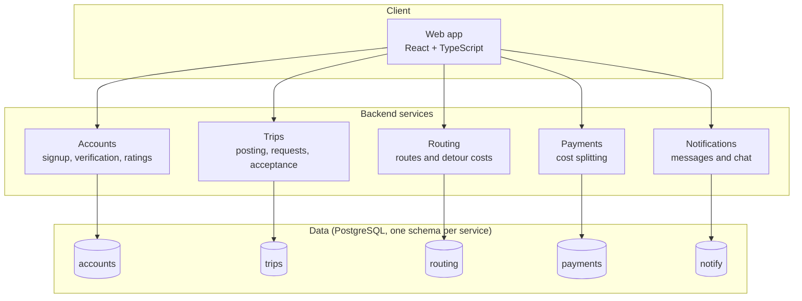
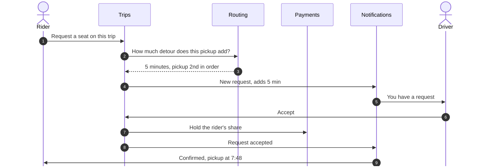

# Vision Statement

GetDrove gives UofM students a seat that's actually theirs.

Getting to Fort Garry without a car means two buses and a transfer with no margin. If the first bus runs five minutes late the connection is gone and the next one is twenty minutes out. Worse, buses fill up before they reach the outer stops, so a student can be on time at the right stop and still watch a full bus drive past. Sometimes the next one is full too. There's no way to plan around it, because the schedule says a bus is coming and it's technically correct. The result is students building a forty-minute buffer into every morning, or showing up late anyway.

The alternative is driving, but a parking pass costs hundreds of dollars and the lots have a waitlist. So students without cars stay stuck with transit, while hundreds of students drive the same routes every morning alone, with three empty seats, paying for fuel and parking by themselves.

The seats exist. The coordination doesn't.

GetDrove closes that gap. Drivers post their commute the night before. The system works out their real driving route, shows the trip to students along it, and tells the driver how many extra minutes each rider would add. Riders get a confirmed seat, a pickup point, a live ETA, and a fair share of the cost based on how far they rode. Both sides are verified and rated, and nobody has to argue about gas money over text.

The goal is simple: a student should be able to take the 8:30 class knowing they'll get there.

# Technology Choices

These are our starting choices for Sprint 0. We expect some to change as the project develops.

## Team-wide choices

- **Architecture:** microservices. Each service is owned end to end, services can be built in parallel, and a failure in one doesn't take down the others. See the architecture section for how they connect.
- **Source control and CI/CD:** GitHub and GitHub Actions. Tests run on every pull request, and the main branch deploys automatically. Security and dependency scanning added for the final iteration.
- **Backend:** Spring Boot or FastAPI. Spring Boot is the stronger option on team familiarity since most of us know Java from coursework, and it's opinionated about structure, which helps when several people are writing services that should look alike. FastAPI is lighter, faster to write, and generates OpenAPI docs with no extra setup. We'll decide in Sprint 1.
- **Frontend:** React with TypeScript. Familiar to the team, and TypeScript catches mismatches with the service APIs early.
- **Database:** PostgreSQL, one schema per service. Reliable and widely used. Separate schemas keep each service's data private, with PostGIS for services that need location queries.
- **Message broker:** Redis Streams (tentative). Lets services react to events without calling each other directly, and is simpler to run than the alternatives.
- **API gateway:** Traefik (tentative). A single entry point for the frontend that forwards each request to the right service and can check login tokens in one place.
- **Local environment:** Docker Compose. The whole system, including the routing engine, runs with one command so everyone is on the same setup and nobody loses time to environment problems. Images published to DockerHub for the final release.

## Owner choices

Each service's owner chooses the tools used inside their service, such as the routing engine, map library, file storage, or email provider, and documents the choice and reasoning in that service's README. PostgreSQL is the default database for all services; an owner can choose a different one if their service has a clear need. Any choice that affects other services, such as a new API or event format, is discussed with the team first.

## Still to decide as a team

The backend framework, the message broker (Redis Streams or RabbitMQ), the API gateway, and where we deploy for the Sprint 1 demo.

# Architecture

## Main diagram

## Example request flow: a rider requests a seat and the driver accepts

