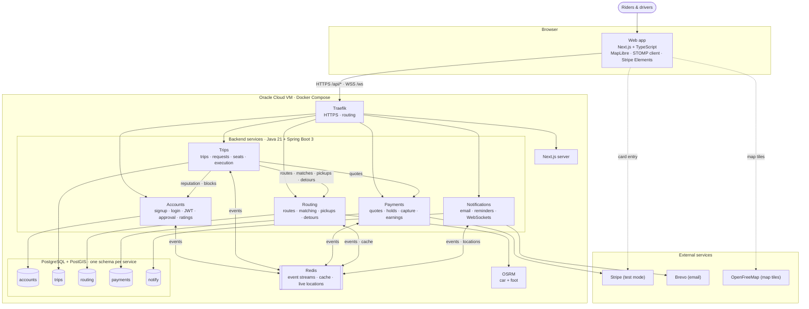

# Sprint 0: Planning and Setup

> Back to [README](README.md)

## Overview

In Sprint 0 we defined the product and who it's for, wrote our core features, user stories with acceptance criteria, and development tasks, set initial non-functional expectations, chose our starting technology stack, sketched a preliminary architecture, set up the repository and project board, and agreed on how we'll work as a team.

**Team:** Code Bros (6 members)

## Product vision

**GetDrove gives UofM students a seat that's actually theirs.** Getting to Fort Garry by transit means tight transfers and full buses that drive past, while hundreds of students drive the same routes alone with empty seats. The seats exist; the coordination doesn't. GetDrove matches riders with drivers whose real driving route passes near them, shows drivers the detour each rider adds, and splits the cost fairly by distance, so a student can take the 8:30 class knowing they'll get there.

Full vision: [Product vision](docs/product/vision.md#vision-statement)

## Customer context

Our customer is **UofM students who commute to the Fort Garry campus**, on both sides of the gap: **riders** without a car or parking pass who lose hours to transit and need a seat they can plan a class schedule around, and **drivers** who already make the commute and would take riders if it didn't cost them a long detour or a no-show. Secondary stakeholders are UofM Parking Services and the people waiting on a student to get home. Faculty, staff, and non-UofM riders are out of scope.

Full context, users, and stakeholders: [Customer context](docs/product/vision.md#customer)

## Core features and user stories

We have **7 core features** (one per team member, plus one), **22 user stories** with acceptance criteria, **52 development tasks** for stories that need a technical breakdown, and **5 stretch goals** kept separate from the core scope. In GitHub, features are parent issues, stories are their sub-issues, and tasks are sub-issues of their story.

1. Accounts and verification
2. Trip posting
3. Route matching
4. Requests and acceptance
5. Trip execution
6. Cost splitting and payment
7. Ratings and safety

- Feature descriptions and stretch goals: [Core features](docs/product/core-features.md)
- [Project board](https://github.com/users/Andrew-Ih/projects/3): **Board** view for progress, **Plan** view for features and stories, **Tasks** view for development tasks
- Issue lists: [Features](https://github.com/Andrew-Ih/COMP-4350-Group5-GetDrove/issues?q=label%3Afeature) · [User stories](https://github.com/Andrew-Ih/COMP-4350-Group5-GetDrove/issues?q=label%3Auser-story) · [Development tasks](https://github.com/Andrew-Ih/COMP-4350-Group5-GetDrove/issues?q=label%3Atask) · [Stretch goals](https://github.com/Andrew-Ih/COMP-4350-Group5-GetDrove/issues?q=label%3Astretch)

## Non-functional expectations

The key targets: detour quotes in under 1 second, route computation within 3 seconds, 50 concurrent users sustained for 5 minutes, trips that keep running if Notifications or Routing is down, home addresses never shown to other users, around 70% test coverage on core logic, and a mobile-first interface usable outdoors in winter.

Full list: [Non-functional expectations](docs/product/non-functional.md)

## Technology decisions

All major technology decisions were made at the end of Sprint 0 and are recorded as [Architecture Decision Records](docs/architecture/adr/README.md).

| Area | Choice |
|---|---|
| Architecture | Microservices (five services) with Clean Architecture inside each; monorepo |
| Frontend | Next.js + TypeScript, MapLibre GL JS with OpenFreeMap tiles |
| Backend | Java 21 + Spring Boot 3, built with Gradle |
| Database | PostgreSQL + PostGIS, one schema per service |
| Messaging | Redis Streams with the transactional outbox pattern |
| Gateway and auth | Traefik (routing + HTTPS); JWTs validated in each service |
| Routing engine | OSRM (self-hosted, car + foot profiles) |
| Payments and email | Stripe (test mode); Brevo (Mailpit locally) |
| Hosting | Oracle Cloud Always Free VM with Docker Compose (AWS Free plan as backup); live site deploys from `develop` |
| CI/CD and quality | GitHub Actions; CodeQL, Trivy, Dependabot; JMeter for load testing |

Reasons, alternatives, and the full list: [Technology stack](docs/architecture/tech-stack.md)

## Architecture

The Next.js web app reaches the five Spring Boot services through Traefik, the only public entry point. Each service owns its own PostgreSQL schema and never reads another service's data. Services call each other over internal REST endpoints when they need an immediate answer, and otherwise communicate through events on Redis Streams, published via a transactional outbox so no event is lost. Routing uses a self-hosted OSRM engine and is isolated because it's the most expensive service. Everything runs with Docker Compose, locally and on an Oracle Cloud VM.

A detailed, colour-coded version of this diagram and the request-seat sequence diagram are in [`getdrove-architecture.drawio`](docs/architecture/getdrove-architecture.drawio). Component details, communication boundaries, and an example request flow: [Architecture](docs/architecture/architecture.md)

## Team process

- [Working agreement](docs/process/working-agreement.md): goals, roles, meetings, conflict resolution, responsible GenAI use, accountability
- [Communication protocol](docs/process/communication.md): Discord, response times, escalation, meetings
- [Planning practices](docs/process/planning.md): iterations, distributing work, coordinating dependencies, integrating contributions, adapting assignments, Definition of Done
- [Git workflow](docs/process/git-workflow.md): Git Flow with feature, release, and hotfix branches
- [Coding standards](docs/process/coding-standards.md): formatting, naming, code quality, service rules, testing
- [Code review practices](docs/process/code-review.md): pull requests, approvals, review checklist

## Repository setup

- [x] Repository with `main` and `develop` branches
- [x] Labels for issue type, system area, and frontend/backend
- [x] Feature, story, and task issues linked as sub-issues
- [x] Project board with Board, Plan, and Tasks views
- [x] Issue templates and pull request template
- [x] Branch protection on `main` and `develop` (pull request with 1 approval required)
